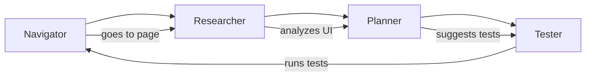

# Explorbot

**The vibe-testing agent for web applications.**

Explorbot explores your web app like a curious human would — clicking around, filling forms, finding bugs, and learning as it goes. No test scripts required. Just point it at your app and let it work.

```bash
explorbot explore --from https://your-app.com
```

## Why Explorbot?

Traditional test automation is a grind: write scripts, update selectors, fix flaky tests, repeat forever. Explorbot flips that:

- **No scripts to maintain** — AI figures out how to interact with your UI
- **Self-healing** — When elements change, it adapts instead of failing
- **Learns your app** — Gets smarter about your specific application over time
- **Generates real tests** — Outputs CodeceptJS code you can run independently
- **Finds the weird stuff** — Explores paths a human might miss

## Requirements

- **Bun** (not Node.js)
- **AI provider API key** — Groq, Cerebras, OpenAI, or Anthropic
- **Modern terminal** — iTerm2, WARP, Kitty, Ghostty. WSL if running on Windows

## Quick Start

```bash
# 1. Install dependencies
bun install

# 2. Create config file
explorbot init

# 3. Configure your AI provider and app URL (see below)

# 4. Start exploring
explorbot explore
```

### Configuration

Edit `explorbot.config.js`:

```javascript
import { createGroq } from '@ai-sdk/groq';

const groq = createGroq({
  apiKey: process.env.GROQ_API_KEY,
});

export default {
  playwright: {
    browser: 'chromium',
    url: 'https://your-app.com',  // Your app URL
  },
  ai: {
    provider: groq,
    model: 'gpt-oss-20b',
    visionModel: 'llama-scout-4',
  },
};
```

**Model recommendations:** Use fast, cheap models with structured output + tool use. Avoid expensive SOTA models (GPT-5, Claude Opus) — they're slow and not cost-effective for exploratory testing.

| Purpose | Recommended |
|---------|-------------|
| Main model | `gpt-oss-20b` |
| Vision model | `llama-scout-4` |

**Recommended providers** (500-1000 TPS): Groq, Cerebras

See [docs/providers.md](docs/providers.md) for OpenAI, Anthropic, and other providers.

## How It Works



Four AI agents work together:

1. **Navigator** — Opens pages, clicks buttons, fills forms
2. **Researcher** — Analyzes UI to understand what's testable
3. **Planner** — Generates prioritized test scenarios
4. **Tester** — Executes tests with automatic error recovery

Run `/explore` and watch the cycle: research → plan → test → repeat.

## Basic Usage

Once in the terminal UI:

```
/explore              # Full cycle: research → plan → test
/research             # Analyze current page
/plan                 # Generate test scenarios
/test                 # Run next test
/navigate /settings   # Go to a page
```

You can also run CodeceptJS commands directly:

```
I.click('Login')
I.fillField('email', 'test@example.com')
I.see('Welcome')
```

See [docs/commands.md](docs/commands.md) for all commands.

## What You Get

| Output | Location | Description |
|--------|----------|-------------|
| Test files | `output/tests/*.js` | CodeceptJS tests you can run independently |
| Test plans | `output/plans/*.md` | Markdown documentation of scenarios |
| Experience | `./experience/` | What Explorbot learned about your app |

## Two Ways to Run

**Interactive mode** — Launch TUI, guide exploration, get real-time feedback:

```bash
explorbot explore --from https://your-app.com
```

**Non-interactive mode** — CI/CD pipelines, automated runs:

```bash
explorbot run --from https://your-app.com --plan login-flow
```

## Core Philosophy

**Strategic decisions are deterministic** — The workflow (research → plan → test) is predictable and consistent.

**Tactical decisions are AI-driven** — How to click that button, what to do when a modal appears, how to recover from errors.

This gives you reliability where it matters and flexibility where you need it. Each agent runs lean with minimal context overhead to keep costs down.

## Teaching Explorbot

Add domain knowledge in `./knowledge/` to help Explorbot understand your app:

```markdown
---
url: /login
---

Test credentials: test@example.com / test123
Submit button disabled until email validates.
```

Explorbot also learns automatically — it saves what works in `./experience/` and gets smarter over time.

## Further Reading

- [docs/commands.md](docs/commands.md) — Full terminal command reference
- [docs/providers.md](docs/providers.md) — AI provider configuration (OpenAI, Anthropic, etc.)
- [docs/agents.md](docs/agents.md) — Detailed agent descriptions and capabilities

---

Explorbot learns as it explores. The more it tests your app, the better it gets at testing your app. That's vibe-testing.
