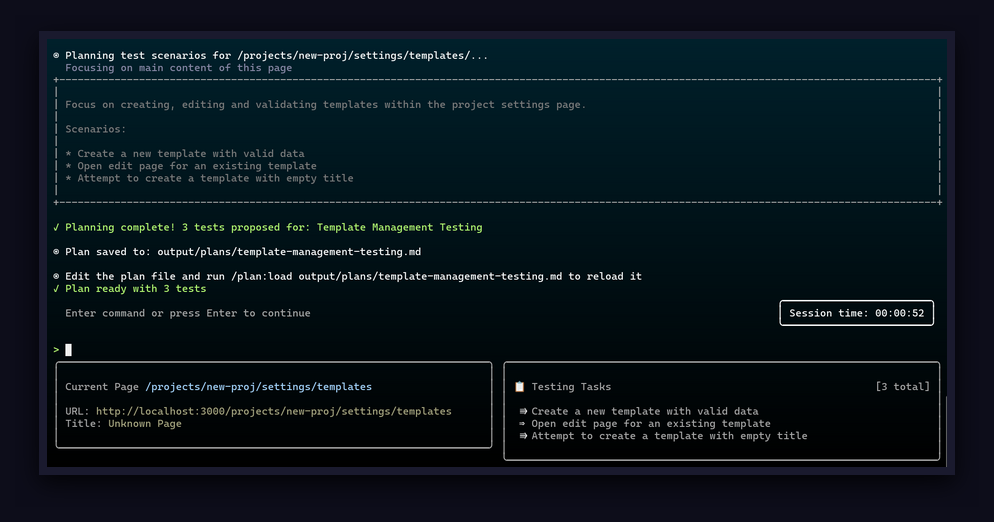
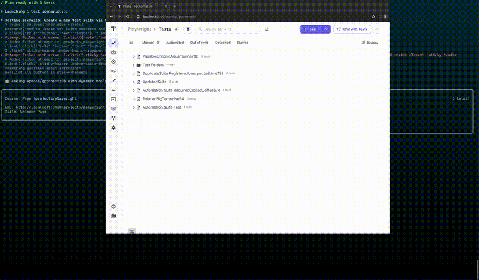
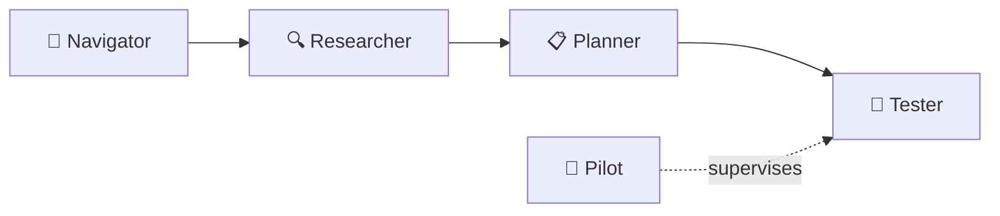

# Explorbot

**The vibe-testing agent for web applications.**



Explorbot explores your web app like a curious human would — clicking around, filling forms, finding bugs, and learning as it goes. No test scripts required. Just point it at your app and let it work.

```bash
explorbot start https://your-app.com
```

Explorbot is your first assitant in testing.
It will do its best to use your application with no babysitting. It will use application and provide you valuable feedback.

## Use Cases

* Autonomously test web application or its parts
* Discover test scenarios and get automated tests for them
* Write manual test cases from exploring website
* 24h/7d of monkey-testing for web application that can reveal hidden errors
* Quick-test for MVPs and prototypes

Explorbot can start testing features which were not covered by unit tests or browser tests.

## Demo



## Requirements

- **Bun** (not Node.js)
- **AI provider API key** — Groq, Cerebras, OpenAI, or Anthropic
- **Modern terminal** — iTerm2, WARP, Kitty, Ghostty. WSL if running on Windows
- **Compatible web app** — Check [docs/prerequisites.md](docs/prerequisites.md) to verify your app works with Explorbot

## Quick Start

**1. Install dependencies**

```bash
bun install
bunx playwright install
```

**2. Initialize config**

```bash
explorbot init
```

**3. Edit `explorbot.config.js`** — set your app URL and AI provider:

> [!IMPORTANT]
> **Explorbot uses three types of models:**
>
> | Type | Config key | Purpose | Recommendation |
> |------|-----------|---------|----------------|
> | **model** | `ai.model` | Standard model for HTML/ARIA processing. Used by Tester, Navigator, Researcher. Should be fast and cheap — these agents are token-hungry. | `gpt-oss-20b` via Groq/Cerebras (100+ TPS) |
> | **visionModel** | `ai.visionModel` | Screenshot analysis. Used when agents need to visually inspect the page. | `llama-scout-4` |
> | **agenticModel** | `ai.agenticModel` | Exceptional decision making. Used by Captain and Pilot — agents that read compact action logs and make high-level decisions. Benefits from a smarter model. | GPT-5, Claude Sonnet, Kimi K2, Qwen 3 |
>
> See [OpenRouter](https://openrouter.ai/rankings#performance) for fastest models.

Groq is used in this example but you can use any provider supported by Vercel AI SDK. See [docs/providers.md](docs/providers.md) for other providers.

```javascript
import { createGroq } from '@ai-sdk/groq';

const groq = createGroq({
  apiKey: process.env.GROQ_API_KEY,
});

export default {
  playwright: {
    browser: 'chromium',
    url: 'https://your-app.com',     // <-- Your app URL
  },
  ai: {
    model: groq('gpt-oss-20b'),            // Fast cheap model for most agents
    visionModel: groq('llama-scout-4'),    // Screenshot analysis
    agenticModel: groq('qwen3-32b'),       // Smarter model for Captain & Pilot
  },
};
```

> [!TIP]
> Captain and Pilot barely use tokens (just action summaries), so a smarter `agenticModel` costs very little while significantly improving test quality. You can also override any agent's model individually via `ai.agents.<name>.model`.

**4. Add knowledge** (optional but recommended)

If your app requires authentication, tell Explorbot how to log in:

```bash
# Interactive mode
explorbot know

# Or via CLI
explorbot know "/login" "Use credentials: admin@example.com / secret123"
```

> [!TIP]
> Use `--session` to persist browser cookies and localStorage between runs. Log in once, and Explorbot will restore the session on next start:
> ```bash
> explorbot start /login --session          # saves to output/session.json
> explorbot start /dashboard --session      # restores session, skips login
> explorbot start /app --session auth.json  # custom session file
> ```

> [!NOTE]
> Use `*` as URL pattern to add general knowledge that applies to all pages. See [docs/knowledge.md](docs/knowledge.md) for more.

**5. Run**

```bash
explorbot start /admin/users
```

Start from a small functional area of your app (admin panel, settings, any CRUD section) so Explorbot can quickly understand its business purpose and context.

Browser runs headless by default — use `--show` to see it:

```bash
explorbot start /settings --show
```

Requires a modern terminal (iTerm2, WARP, Kitty, Ghostty, Windows Terminal). On Windows, use WSL.

## How It Works

Explorbot explores websites, analyzes their UI, and proposes tests — which it can then execute. It controls its own browser through CodeceptJS → Playwright (no MCP involved).


```mermaid
flowchart LR
    N[🧭 Navigator] --> R[🔍 Researcher] --> P[📋 Planner] --> T[🧪 Tester]
    Pi[🎯 Pilot] -.->|supervises| T
```

| 🧭 Navigator | 🔍 Researcher | 📋 Planner | 🧪 Tester |
|--------------|---------------|------------|-----------|
| Opens pages | Analyzes UI | Generates test scenarios | Executes tests |
| Clicks buttons, fills forms | Discovers all interactive elements | Assigns priorities (HIGH/MED/LOW) | Adapts when things fail |
| Self-heals broken selectors | Expands hidden content | Balances positive & negative cases | Documents results |

Run `/explore` in TUI or use `explorbot explore` from CLI to watch the cycle: research → plan → test → repeat.

**Supporting components:**

* **Pilot** — supervises Tester from a separate conversation: reviews action logs, detects stuck patterns, makes final pass/fail decisions. Uses `agenticModel` since it only processes compact summaries, not raw HTML
* **Historian** — saves sessions as CodeceptJS code, learns from experience
* **Quartermaster** — analyzes pages for A11y issues (axe-core + semantic)
* **Reporter** — sends test results to Testomat.io

## Basic Usage

Once in the terminal UI:

```
/explore              # Full cycle: research → plan → test
/research             # Analyze current page
/plan                 # Generate test scenarios
/test                 # Run next test
/navigate /settings   # Go to a page
```

You can also run CodeceptJS commands directly:

```
I.click('Login')
I.fillField('email', 'test@example.com')
I.see('Welcome')
```

See [docs/commands.md](docs/commands.md) for all commands.

> [!NOTE]
> Most TUI commands also have CLI equivalents that run headless and exit. For example, `explorbot research <url>` and `explorbot plan <path>` work without launching TUI. See [docs/commands.md](docs/commands.md) for the full mapping.

## What You Get

| Output | Location | Description |
|--------|----------|-------------|
| Test files | `output/tests/*.js` | CodeceptJS tests you can run independently |
| Test plans | `output/plans/*.md` | Markdown documentation of scenarios |
| Experience | `./experience/` | What Explorbot learned about your app |

## Two Ways to Run

**Interactive mode** — Launch TUI, guide exploration, get real-time feedback:

```bash
explorbot start https://your-app.com
```

**Autonomous mode** — Non-interactive testing and planning:

```bash
explorbot explore /admin/users
```

**Freesail mode** — Fully autonomous, continuous exploration across multiple pages:

```bash
explorbot freesail /admin              # explore and test pages indefinitely
explorbot freesail /app --deep         # depth-first: explore nearby pages first
explorbot freesail /app --shallow      # breadth-first: spread across many pages
explorbot freesail /app --scope /admin # restrict to URLs under /admin
```

Freesail navigates to a page, researches it, runs tests, then moves on to the next least-visited page — repeating until stopped. Also available as `/freesail` in TUI.

## Core Philosophy

**Strategic decisions are deterministic** — The workflow (research → plan → test) is predictable and consistent.

**Tactical decisions are AI-driven** — How to click that button, what to do when a modal appears, how to recover from errors.

**Cheap workers, smart managers** — Tester, Navigator, and Researcher are token-hungry agents that chew through HTML and ARIA on every step. They run on the fast, cheap `model`. Captain and Pilot are the decision-makers — they read only compact action logs and make high-level choices. Set `agenticModel` to a smarter model for better results at negligible extra cost.

**Explorbot learns from its failures** — It uses previous experience interacting with a web page for faster and better decisions on next runs.

**Explorbot needs your knowledge** — You adjust Explorbot prompts by passing suggestions, UI explanations, and domain knowledge as text files, which are loaded when the corresponding page is opened.

When tuned, Explorbot **can run autonomously for hours** navigating a web application and trying different scenarios. You don't need to watch it. The more Explorbot runs, the more it learns and the more complex scenarios it can test.


## Teaching Explorbot

* **Knowledge** (`./knowledge/`) — Tell Explorbot about your app: credentials, form rules, navigation quirks. See [docs/knowledge.md](docs/knowledge.md).
* **Experience** (`./experience/`) — Explorbot learns automatically from successful interactions and saves what works.

## Further Reading

- [docs/prerequisites.md](docs/prerequisites.md) — Application compatibility checklist
- [docs/commands.md](docs/commands.md) — Terminal command reference
- [docs/knowledge.md](docs/knowledge.md) — Knowledge system and URL patterns
- [docs/providers.md](docs/providers.md) — AI provider configuration
- [docs/agents.md](docs/agents.md) — Agent descriptions and capabilities
- [docs/scripting.md](docs/scripting.md) — Building custom autonomous scripts
- [docs/observability.md](docs/observability.md) — Langfuse tracing and debugging
- [docs/page-interaction.md](docs/page-interaction.md) — How agents interact with pages

## FAQ

**Can I run it in Cursor? or Claude Code?**
No, Explorbot is a separate application designed for constant testing. Cursor, Codex, or Claude Code are coding agents — not relevant here.

**Why do you hate Opus?**
Opus is great for coding. Here we need a simple model that can consume lots of HTML tokens to find the relevant ones. Leave more interesting tasks to Opus.

**Is that expensive?**
No. It costs ~$1 per hour of running if you use Groq Cloud with gpt-oss-20b.

**Does Explorbot have MCP?**
Not yet.

**Can I build my own agents with it?**
Yes, use the programmatic API. See [docs/scripting.md](docs/scripting.md).

**Ok, but I can do the same in Cursor with Playwright MCP!**
Good luck running it on CI! Also, you'll need to check on it every 10 seconds to see how it's running the browser.

## License

Explorbot is licensed under the [Elastic License 2.0 (ELv2)](LICENSE).

**Free for commercial use** — you can use Explorbot to test any application, including commercial products, without paying a license fee. You can modify it, self-host it, and integrate it into your workflow.

The only restriction: you may not offer Explorbot itself as a hosted/managed service (i.e., resell it as a product). This license is used by Elastic, Grafana, and other open-source companies.

Explorbot is built by [Testomat.io](https://testomat.io).

---

Explorbot learns as it explores. The more it tests your app, the better it gets at testing your app. That's vibe-testing.
