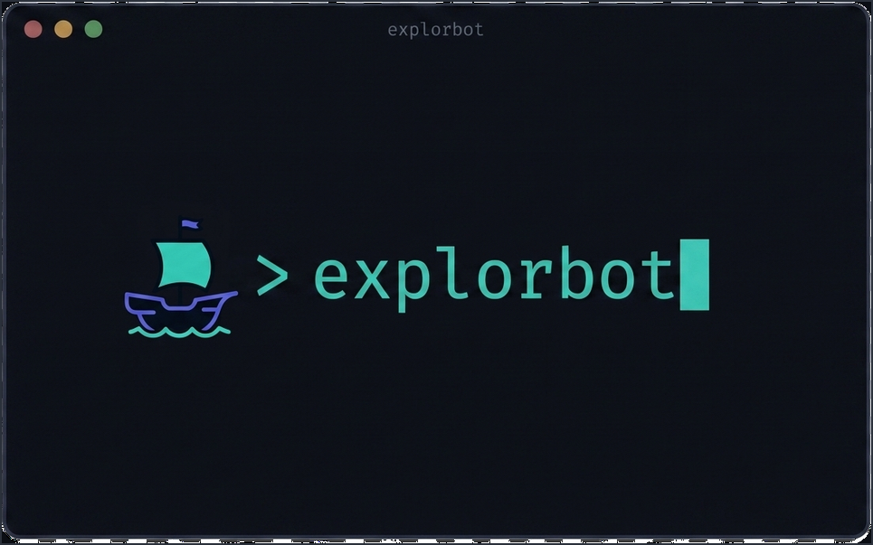

<p align="center">
  
</p>

<p align="center"><b>The vibe-testing agent for web applications.</b></p>


Explorbot is an AI agent that investigates your product like your most relentless QA engineer — clicking around, filling forms, and finding bugs. It turns every discovery into a test you can keep. No test scripts required. Just point it at your app and let it work.

```bash
npx explorbot start https://your-app.com
```

It runs with no babysitting and reports back what it finds. This is vibe-testing.

Explorbot works with any AI provider through the [Vercel AI SDK](https://sdk.vercel.ai/providers). See [`models.json`](models.json) for the current recommended provider and model setup, and [Providers](docs/basics/providers.md) for how to configure each one.

New here? Read the [Getting Started guide](docs/basics/getting-started.md).

## Use Cases

* Autonomously test a web application or parts of it
* Discover test scenarios and get automated tests for them
* Write manual test cases from exploring a website
* 24/7 monkey-testing that reveals hidden errors
* Quick-test for MVPs and prototypes

Explorbot tests features that unit tests and scripted browser tests never reach.

## Demo


## A new layer of testing

Unit tests check a function. End-to-end tests replay fixed user journeys. **Exploratory tests** investigate the app the way a curious tester would — taking new paths every run and catching what no one thought to script.

Explorbot makes that third layer routine. It runs on your CI next to the other two, and everything stays local — no cloud service touches your app.

## How a session works

Give Explorbot a goal and a URL. A crew of agents takes it from there — no scripts, no human in the loop.

1. **Research** — map the page into sections and index every element. No source or docs needed.
2. **Plan** — draft test scenarios across normal, curious, and edge styles.
3. **Execute** — drive the browser step by step, adapting as the app changes.
4. **Verify** — confirm each outcome, cluster findings by root cause, and capture evidence.
5. **Keep** — save passing flows as real tests, with reports and screencasts — and learn for next run.


## The crew

Cheap, fast workers do the clicking and reading; smart managers make the calls — so a full session costs cents, not dollars.

| | | |
|---|---|---|
| [Researcher](docs/web-testing/agents.md) | [Planner](docs/web-testing/agents.md) | [Tester](docs/web-testing/agents.md) |
| [Pilot](docs/web-testing/agents.md) | [Captain](docs/web-testing/agents.md) | [Navigator](docs/web-testing/agents.md) |
| [Analyst](docs/web-testing/agents.md) | [Historian](docs/web-testing/agents.md) | [Fisherman](docs/web-testing/agents.md) |

See [Agents](docs/web-testing/agents.md) for what each one does.

## Core Philosophy

**Strategic decisions are deterministic** — the workflow (research → plan → test) is predictable and consistent.

**Tactical decisions are AI-driven** — how to click a button, what to do when a modal appears, how to recover from an error.

**Cheap workers, smart managers** — token-hungry agents run on a fast, cheap model. The decision-makers read only short action logs, so a smarter model there costs almost nothing.

**Explorbot learns from failure** — it reuses past experience with a page to make faster, better decisions next time.

**Explorbot needs your knowledge** — you guide it with plain-text notes and domain hints, loaded when the matching page opens.

When tuned, Explorbot **runs autonomously for hours**, trying new scenarios on its own. The more it runs, the more it learns.

## Tests, reports, videos

Every run leaves behind:

- **Runnable tests** — Playwright or CodeceptJS specs for every flow, ready to commit and run in CI.
- **Reports** — a pass/fail breakdown with a written analysis, as HTML and Markdown, or in Testomat.io.
- **Videos** — step-by-step screencasts of every run.
- **Experience** — what Explorbot learned, reused to test smarter next time.

See [Automated Tests](docs/web-testing/automated-tests.md) for the test output and [Reporting](docs/workflow/reporting.md) for reports.

## It works with your suite

Explorbot won't replace your regression tests — it covers what they can't. Your Playwright or CodeceptJS suites replay the same fixed steps every build. Explorbot re-explores the same pages new ways, clicking UI and paths your scripts never touch. Point it at a brand-new feature with zero coverage, and it works out the basic test cases and runs them right away.

## Requirements

- Node.js 24+ or **Bun**
- An **AI provider key** — OpenRouter recommended; Groq, Cerebras, [OpenAI](docs/basics/providers.md#openai), Anthropic, and others via the [Vercel AI SDK](https://sdk.vercel.ai/providers)
- A **modern terminal** — iTerm2, WARP, Kitty, Ghostty, or Windows Terminal with WSL
- A **compatible web app** — CRUD-heavy apps fit best. See [Prerequisites](docs/basics/prerequisites.md)

If your CI runs Playwright, it runs Explorbot. No GPUs, no special runners.

## Quick Start

**1. Install dependencies**

```bash
npm i explorbot --save
npx playwright install
```

**2. Initialize config**

```bash
npx explorbot init
```

**3. Configure and run**

Add your AI provider key to `.env`, set your app URL in `explorbot.config.js`, then point Explorbot at a focused page — an admin panel, settings, or any CRUD section:

```bash
npx explorbot start /admin/users
```

Type `/explore`, and Explorbot runs its loop on its own — research, plan, test, repeat — learning from every run.

That's the gist. The [**Getting Started guide**](docs/basics/getting-started.md) walks through the full setup — choosing models, teaching Explorbot to log in, and picking the right feature to start on.

### Or skip the config file

For a CI job, a demo, or a coding agent, pass everything as environment variables. Name a provider and Explorbot picks its recommended models:

```bash
EXPLORBOT_URL=https://app.example.com \
EXPLORBOT_AI_PROVIDER=openrouter \
EXPLORBOT_KNOWLEDGE="Log in as admin@example.com / secret123" \
  npx explorbot explore /admin/users --max-tests 3
```

Output lands in a temp directory and nothing is written to your project. See [Agentic Usage](docs/workflow/agentic-usage.md).

## Teaching Explorbot

Explorbot gets better when you tell it about your app:

- **Knowledge** — credentials, form rules, navigation quirks. See [Knowledge](docs/workflow/knowledge.md).
- **Rules** — per-agent, per-page instructions. See [Configuration](docs/reference/configuration.md#rules).
- **Experience** — learned automatically from what works.

Handling logins, cookie banners, modals, and test data takes a few lines — see [Customization](docs/web-testing/customization.md).

## It also tests REST APIs

Point Explorbot at an OpenAPI spec and it plans and runs API tests too. See [API Testing](docs/api-testing/basics.md).

## Keep going

When you're ready to go deeper, the [full documentation](docs/) covers everything, starting with the [Getting Started guide](docs/basics/getting-started.md).

## FAQ

**Can I run it in Cursor or Claude Code?**
Not as a replacement — Explorbot is a separate application designed for constant testing, while Cursor, Codex, and Claude Code are coding agents. But a coding agent can drive Explorbot as a terminal command or subagent: it writes the test plan, Explorbot executes it against the real app. See [Agentic Usage](docs/workflow/agentic-usage.md).

**Can I bring a Cursor or OpenAI subscription?**
No. Explorbot needs an API key, not a chat subscription. Use pay-per-token access — Groq, OpenRouter, or OpenAI's own API.

**Can I use OpenAI directly?**
Yes. Add your `OPENAI_API_KEY` and point the models at OpenAI — a nano-class model for `model` and `visionModel`, a stronger one for `agenticModel`. Expect it to run a bit slower than hosted OSS models on Groq or Cerebras. See [Providers](docs/basics/providers.md#openai) for the config.

**I want to use Opus!!!**
Opus is great for coding. Testing needs a simpler model that can safely consume lots of HTML tokens, fast. Save the expensive models for sophisticated decision-making.

**Is it expensive?**
No. With fast open models (e.g. `openai/gpt-oss-20b` on OpenRouter or Groq), expect roughly **~$1/hour of continuous run**, depending on provider and traffic.

**Does Explorbot have MCP?**
Not yet.

**Can I build my own agents with it?**
Yes, use the programmatic API. See [Scripting](docs/reference/scripting.md).

**Can I do the same in Cursor with Playwright MCP?**
Good luck running it on CI!

## Development

* Clone this repository
* Use **Bun** to run TS and TSX with no building
* Create a sample project under the `example` directory:

```
./bin/explorbot-cli.ts init --path example
```

* Run your commands using `--path example`

```
./bin/explorbot-cli.ts start --path example
```

## License

Explorbot is licensed under the [Elastic License 2.0 (ELv2)](LICENSE).

**Free for commercial use** — you can use Explorbot to test any application, including commercial products, without paying a license fee. You can modify it, self-host it, and integrate it into your workflow.

The only restriction: you may not offer Explorbot itself as a hosted/managed service (i.e., resell it as a product). This license is used by Elastic, Grafana, and other open-source companies.

Explorbot is built by [Testomat.io](https://testomat.io).
