# Explorbot

**The vibe-testing agent for web applications.**

Explorbot explores your web app like a curious human would — clicking around, filling forms, finding bugs, and learning as it goes. No test scripts required. Just point it at your app and let it work.

```bash
explorbot explore --from https://your-app.com
```

## Why Explorbot?

Traditional test automation is a grind: write scripts, update selectors, fix flaky tests, repeat forever. Explorbot flips that:

- **No scripts to maintain** — AI figures out how to interact with your UI
- **Self-healing** — When elements change, it adapts instead of failing
- **Learns your app** — Gets smarter about your specific application over time
- **Generates real tests** — Outputs CodeceptJS code you can run independently
- **Finds the weird stuff** — Explores paths a human might miss

## Requirements

- **Bun** (not Node.js)
- **AI provider API key** — Groq, Cerebras, OpenAI, or Anthropic
- **Modern terminal** — iTerm2, WARP, Kitty, Ghostty. WSL if running on Windows

## Quick Start

```bash
# 1. Install dependencies
bun install

# 2. Create config file
explorbot init

# 3. Configure your AI provider and app URL (see below)

# 4. Start exploring
explorbot explore
```

### Configuration

Edit `explorbot.config.js`:

```javascript
import { createGroq } from '@ai-sdk/groq';

const groq = createGroq({
  apiKey: process.env.GROQ_API_KEY,  // Set GROQ_API_KEY in your environment
});

export default {
  playwright: {
    browser: 'chromium',             // Browser engine: chromium, firefox, or webkit
    url: 'https://your-app.com',     // Starting URL for your application
  },
  ai: {
    provider: groq,                  // AI provider instance (Vercel AI SDK)
    model: 'gpt-oss-20b',            // Main model for agents
    visionModel: 'llama-scout-4',    // Vision model for screenshot analysis
  },
};
```

**What each field does:**

| Field | Purpose |
|-------|---------|
| `playwright.browser` | Browser to automate. Chromium recommended for best compatibility. |
| `playwright.url` | Your app's URL. Explorbot starts here when you run `/explore`. |
| `ai.provider` | AI provider from Vercel AI SDK. We recommend Groq for speed. |
| `ai.model` | Main model used by all agents. Must support tool use + structured output. |
| `ai.visionModel` | Model for analyzing screenshots. Used by Researcher agent. |

> [!IMPORTANT]
> **Use fast, lightweight models.** Explorbot agents make many rapid API calls. Expensive SOTA models (GPT-5, Claude Opus) are overkill — they're slow and will burn through your budget. Stick with efficient models like `gpt-oss-20b`.

**Recommended setup:**

| Purpose | Model | Provider |
|---------|-------|----------|
| Main model | `gpt-oss-20b` | Groq, Cerebras |
| Vision model | `llama-scout-4` | Groq, Cerebras |

> [!NOTE]
> We recommend providers with 500-1000 TPS (tokens per second) for smooth operation. Groq and Cerebras offer this level of throughput.

See [docs/providers.md](docs/providers.md) for OpenAI, Anthropic, and other providers.

## How It Works

```mermaid
flowchart LR
    N[🧭 Navigator] --> R[🔍 Researcher] --> P[📋 Planner] --> T[🧪 Tester]
```



| 🧭 Navigator | 🔍 Researcher | 📋 Planner | 🧪 Tester |
|--------------|---------------|------------|-----------|
| Opens pages | Analyzes UI | Generates test scenarios | Executes tests |
| Clicks buttons, fills forms | Discovers all interactive elements | Assigns priorities (HIGH/MED/LOW) | Adapts when things fail |
| Self-heals broken selectors | Expands hidden content | Balances positive & negative cases | Documents results |

Run `/explore` and watch the cycle: research → plan → test → repeat.

**Supporting components:**

* **Historian** — saves sessions as CodeceptJS code, learns from experience
* **Quartermaster** — analyzes pages for A11y issues (axe-core + semantic)
* **Reporter** — sends test results to Testomat.io

## Basic Usage

Once in the terminal UI:

```
/explore              # Full cycle: research → plan → test
/research             # Analyze current page
/plan                 # Generate test scenarios
/test                 # Run next test
/navigate /settings   # Go to a page
```

You can also run CodeceptJS commands directly:

```
I.click('Login')
I.fillField('email', 'test@example.com')
I.see('Welcome')
```

See [docs/commands.md](docs/commands.md) for all commands.

## What You Get

| Output | Location | Description |
|--------|----------|-------------|
| Test files | `output/tests/*.js` | CodeceptJS tests you can run independently |
| Test plans | `output/plans/*.md` | Markdown documentation of scenarios |
| Experience | `./experience/` | What Explorbot learned about your app |

## Two Ways to Run

**Interactive mode** — Launch TUI, guide exploration, get real-time feedback:

```bash
explorbot explore --from https://your-app.com
```

**Non-interactive mode** — CI/CD pipelines, automated runs:

```bash
explorbot run --from https://your-app.com --plan login-flow
```

## Core Philosophy

**Strategic decisions are deterministic** — The workflow (research → plan → test) is predictable and consistent.

**Tactical decisions are AI-driven** — How to click that button, what to do when a modal appears, how to recover from errors.

This gives you reliability where it matters and flexibility where you need it. Each agent runs lean with minimal context overhead to keep costs down.

## Teaching Explorbot

Add domain knowledge in `./knowledge/` to help Explorbot understand your app:

```markdown
---
url: /login
---

Test credentials: test@example.com / test123
Submit button disabled until email validates.
```

Explorbot also learns automatically — it saves what works in `./experience/` and gets smarter over time.

## Further Reading

- [docs/commands.md](docs/commands.md) — Full terminal command reference
- [docs/providers.md](docs/providers.md) — AI provider configuration (OpenAI, Anthropic, etc.)
- [docs/agents.md](docs/agents.md) — Detailed agent descriptions and capabilities

---

Explorbot learns as it explores. The more it tests your app, the better it gets at testing your app. That's vibe-testing.
