# Explorbot

**The vibe-testing agent for web applications.**


Explorbot explores your web app like a curious human would — clicking around, filling forms, finding bugs, and learning as it goes. No test scripts required. Just point it at your app and let it work.

```bash
explorbot explore --from https://your-app.com
```

Explorbot is your first assitant in testing.
It will do its best to use your application with no babysitting. It will use application and provide you valuable feedback.

## Use Cases

* Autonomously test web application or its parts
* Discover test scenarios and get automated tests for them
* Write manual test cases from exploring website
* 24h/7d of monkey-testing for web application that can reveal hidden errors
* Quick-test for MVPs and prototypes

Explorbot can start testing features which were not covered by unit tests or browser tests.

## Demo


## Requirements

- **Bun** (not Node.js)
- **AI provider API key** — Groq, Cerebras, OpenAI, or Anthropic
- **Modern terminal** — iTerm2, WARP, Kitty, Ghostty. WSL if running on Windows

## Quick Start

**1. Install dependencies**

```bash
bun install
bunx playwright install
```

**2. Initialize config**

```bash
explorbot init
```

**3. Edit `explorbot.config.js`** — set your app URL and AI provider:

> [!IMPORTANT]
> **Use fast, lightweight models.** Explorbot agents make many rapid API calls. Expensive SOTA models (GPT-5, Claude Opus) are overkill — slow and costly. Stick with `gpt-oss-20b` or similar. Recommended providers (500-1000 TPS): Groq, Cerebras. 

Groq is used in this example but you can use any provider supported by Vercel AI SDK. See [docs/providers.md](docs/providers.md) for other providers.

```javascript
import { createGroq } from '@ai-sdk/groq';

const groq = createGroq({
  apiKey: process.env.GROQ_API_KEY,  // Set in .env file (loaded automatically)
});

export default {
  playwright: {
    browser: 'chromium',
    url: 'https://your-app.com',     // <-- Your app URL
  },
  ai: {
    provider: groq,
    model: 'gpt-oss-20b',            // Fast model with tool use
    visionModel: 'llama-scout-4',    // Fast vision model
  },
};
```

**4. Add knowledge** (optional but recommended)

If your app requires authentication, tell Explorbot how to log in:

```bash
# Interactive mode
explorbot know

# Or via CLI
explorbot know "/login" "Use credentials: admin@example.com / secret123"
```

> [!NOTE]
> Use `*` as URL pattern to add general knowledge that applies to all pages. See [docs/knowledge.md](docs/knowledge.md) for more.

**5. Run**

```bash
explorbot explore --from /admin/users
```

Start from a small functional area of your app (admin panel, settings, any CRUD section) so Explorbot can quickly understand its business purpose and context.

Browser runs headless by default — use `--show` to see it:

```bash
explorbot explore --from /settings --show
```

Requires a modern terminal (iTerm2, WARP, Kitty, Ghostty, Windows Terminal). On Windows, use WSL.

## How It Works

Explorbot explores websites, analyzes their UI, and proposes tests — which it can then execute. It controls its own browser through CodeceptJS → Playwright (no MCP involved).

```mermaid
flowchart LR
    N[🧭 Navigator] --> R[🔍 Researcher] --> P[📋 Planner] --> T[🧪 Tester]
```



| 🧭 Navigator | 🔍 Researcher | 📋 Planner | 🧪 Tester |
|--------------|---------------|------------|-----------|
| Opens pages | Analyzes UI | Generates test scenarios | Executes tests |
| Clicks buttons, fills forms | Discovers all interactive elements | Assigns priorities (HIGH/MED/LOW) | Adapts when things fail |
| Self-heals broken selectors | Expands hidden content | Balances positive & negative cases | Documents results |

Run `/explore` and watch the cycle: research → plan → test → repeat.

**Supporting components:**

* **Historian** — saves sessions as CodeceptJS code, learns from experience
* **Quartermaster** — analyzes pages for A11y issues (axe-core + semantic)
* **Reporter** — sends test results to Testomat.io

## Basic Usage

Once in the terminal UI:

```
/explore              # Full cycle: research → plan → test
/research             # Analyze current page
/plan                 # Generate test scenarios
/test                 # Run next test
/navigate /settings   # Go to a page
```

You can also run CodeceptJS commands directly:

```
I.click('Login')
I.fillField('email', 'test@example.com')
I.see('Welcome')
```

See [docs/commands.md](docs/commands.md) for all commands.

## What You Get

| Output | Location | Description |
|--------|----------|-------------|
| Test files | `output/tests/*.js` | CodeceptJS tests you can run independently |
| Test plans | `output/plans/*.md` | Markdown documentation of scenarios |
| Experience | `./experience/` | What Explorbot learned about your app |

## Two Ways to Run

**Interactive mode** — Launch TUI, guide exploration, get real-time feedback:

```bash
explorbot explore --from https://your-app.com
```

**Non-interactive mode** — CI/CD pipelines, automated runs:

```bash
explorbot run --from https://your-app.com --plan login-flow
```

## Core Philosophy

**Strategic decisions are deterministic** — The workflow (research → plan → test) is predictable and consistent.

**Tactical decisions are AI-driven** — How to click that button, what to do when a modal appears, how to recover from errors.

**ExplorBot learns from its failures** - it uses previous experience interacting with a web page for faster and better decision on next runs

**Explorbots needs your knowledge** - you adjust Explorbot prompts by passing suggestions, UI explanatins, domain knowledge, in format of text filesm which are loaded when corresponding page loaded.

Thus, when tuned, Explorbot **can run autonomously for hours** navigating web application and trying different scenarios over UI. You don't need to watch it. Explorbot execution is fully autonomous. The more Explorbot runs the more it learns and can test more complex scenarios. 


## Teaching Explorbot

* **Knowledge** (`./knowledge/`) — Tell Explorbot about your app: credentials, form rules, navigation quirks. See [docs/knowledge.md](docs/knowledge.md).
* **Experience** (`./experience/`) — Explorbot learns automatically from successful interactions and saves what works.

## Further Reading

- [docs/commands.md](docs/commands.md) — Terminal command reference
- [docs/knowledge.md](docs/knowledge.md) — Knowledge system and URL patterns
- [docs/providers.md](docs/providers.md) — AI provider configuration
- [docs/agents.md](docs/agents.md) — Agent descriptions and capabilities
- [docs/scripting.md](docs/scripting.md) — Building custom autonomous scripts
- [docs/observability.md](docs/observability.md) — Langfuse tracing and debugging
- [docs/page-interaction.md](docs/page-interaction.md) — How agents interact with pages

## FAQ

**Can I run it in Cursor? or Claude Code?**
No, Explorbot is a separate application designed for constant testing. Cursor, Codex, or Claude Code are coding agents — not relevant here.

**Why do you hate Opus?**
Opus is great for coding. Here we need a simple model that can consume lots of HTML tokens to find the relevant ones. Leave more interesting tasks to Opus.

**Is that expensive?**
No. It costs ~$1 per hour of running if you use Groq Cloud with gpt-oss-20b.

**Does Explorbot have MCP?**
Not yet.

**Can I build my own agents with it?**
Yes, use the programmatic API. See [docs/scripting.md](docs/scripting.md).

**Ok, but I can do the same in Cursor with Playwright MCP!**
Good luck running it on CI! Also, you'll need to check on it every 10 seconds to see how it's running the browser.

---

Explorbot learns as it explores. The more it tests your app, the better it gets at testing your app. That's vibe-testing.
