# Explorbot

**The vibe-testing agent for web applications.**

Explorbot explores your web app like a curious human would — clicking around, filling forms, finding bugs, and learning as it goes. No test scripts required. Just point it at your app and let it work.

```bash
explorbot explore --from https://your-app.com
```

## Why Explorbot?

Traditional test automation is a grind: write scripts, update selectors, fix flaky tests, repeat forever. Explorbot flips that:

- **No scripts to maintain** — AI figures out how to interact with your UI
- **Self-healing** — When elements change, it adapts instead of failing
- **Learns your app** — Gets smarter about your specific application over time
- **Generates real tests** — Outputs CodeceptJS code you can run independently
- **Finds the weird stuff** — Explores paths a human might miss

## Requirements

- **Bun** (not Node.js)
- **AI provider API key** — Groq, Cerebras, OpenAI, or Anthropic
- **Modern terminal** — iTerm2, WARP, Kitty, Ghostty. WSL if running on Windows

## Quick Start

**1. Install dependencies**

```bash
bun install
```

**2. Initialize config**

```bash
explorbot init
```

**3. Edit `explorbot.config.js`** — set your app URL and AI provider:

> [!IMPORTANT]
> **Use fast, lightweight models.** Explorbot agents make many rapid API calls. Expensive SOTA models (GPT-5, Claude Opus) are overkill — slow and costly. Stick with `gpt-oss-20b` or similar. Recommended providers (500-1000 TPS): Groq, Cerebras. 

Groq is used in this example but you can use any provider supported by Vercel AI SDK. See [docs/providers.md](docs/providers.md) for other providers.

```javascript
import { createGroq } from '@ai-sdk/groq';

const groq = createGroq({
  apiKey: process.env.GROQ_API_KEY,  // Set in .env file (loaded automatically)
});

export default {
  playwright: {
    browser: 'chromium',
    url: 'https://your-app.com',     // <-- Your app URL
  },
  ai: {
    provider: groq,
    model: 'gpt-oss-20b',            // Fast model with tool use
    visionModel: 'llama-scout-4',    // Fast vision model
  },
};
```

**4. Add knowledge** (optional but recommended)

If your app requires authentication, tell Explorbot how to log in:

```bash
# Interactive mode
explorbot know

# Or via CLI
explorbot know "/login" "Use credentials: admin@example.com / secret123"
```

> [!NOTE]
> Use `*` as URL pattern to add general knowledge that applies to all pages. See [docs/knowledge.md](docs/knowledge.md) for more.

**5. Run**

```bash
explorbot explore --from /sub-page
```

This launches the Terminal UI. Requires a modern terminal (iTerm2, WARP, Kitty, Ghostty, Windows Terminal). On Windows, use WSL.

## How It Works

```mermaid
flowchart LR
    N[🧭 Navigator] --> R[🔍 Researcher] --> P[📋 Planner] --> T[🧪 Tester]
```

Explorbot explores websites, analyzes their UI, and proposes tests — which it can then execute. It controls its own browser through CodeceptJS → Playwright (no MCP involved).



| 🧭 Navigator | 🔍 Researcher | 📋 Planner | 🧪 Tester |
|--------------|---------------|------------|-----------|
| Opens pages | Analyzes UI | Generates test scenarios | Executes tests |
| Clicks buttons, fills forms | Discovers all interactive elements | Assigns priorities (HIGH/MED/LOW) | Adapts when things fail |
| Self-heals broken selectors | Expands hidden content | Balances positive & negative cases | Documents results |

Run `/explore` and watch the cycle: research → plan → test → repeat.

**Supporting components:**

* **Historian** — saves sessions as CodeceptJS code, learns from experience
* **Quartermaster** — analyzes pages for A11y issues (axe-core + semantic)
* **Reporter** — sends test results to Testomat.io

## Basic Usage

Once in the terminal UI:

```
/explore              # Full cycle: research → plan → test
/research             # Analyze current page
/plan                 # Generate test scenarios
/test                 # Run next test
/navigate /settings   # Go to a page
```

You can also run CodeceptJS commands directly:

```
I.click('Login')
I.fillField('email', 'test@example.com')
I.see('Welcome')
```

See [docs/commands.md](docs/commands.md) for all commands.

## What You Get

| Output | Location | Description |
|--------|----------|-------------|
| Test files | `output/tests/*.js` | CodeceptJS tests you can run independently |
| Test plans | `output/plans/*.md` | Markdown documentation of scenarios |
| Experience | `./experience/` | What Explorbot learned about your app |

## Two Ways to Run

**Interactive mode** — Launch TUI, guide exploration, get real-time feedback:

```bash
explorbot explore --from https://your-app.com
```

**Non-interactive mode** — CI/CD pipelines, automated runs:

```bash
explorbot run --from https://your-app.com --plan login-flow
```

## Core Philosophy

**Strategic decisions are deterministic** — The workflow (research → plan → test) is predictable and consistent.

**Tactical decisions are AI-driven** — How to click that button, what to do when a modal appears, how to recover from errors.

This gives you reliability where it matters and flexibility where you need it. Each agent runs lean with minimal context overhead to keep costs down.

## Teaching Explorbot

* **Knowledge** (`./knowledge/`) — Tell Explorbot about your app: credentials, form rules, navigation quirks. See [docs/knowledge.md](docs/knowledge.md).
* **Experience** (`./experience/`) — Explorbot learns automatically from successful interactions and saves what works.

## Further Reading

- [docs/commands.md](docs/commands.md) — Terminal command reference
- [docs/knowledge.md](docs/knowledge.md) — Knowledge system and URL patterns
- [docs/providers.md](docs/providers.md) — AI provider configuration
- [docs/agents.md](docs/agents.md) — Agent descriptions and capabilities

---

Explorbot learns as it explores. The more it tests your app, the better it gets at testing your app. That's vibe-testing.
