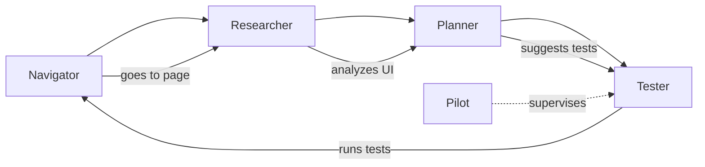

# AI Agents

Explorbot uses specialized AI agents that each handle a specific part of the testing workflow. This separation keeps each agent focused and cost-efficient.

## Agent Overview


```mermaid
flowchart LR
    A[Navigator] --> B[Researcher] --> C[Planner] --> D[Tester]
    A -- "goes to page" --> B
    B -- "analyzes UI" --> C
    C -- "suggests tests" --> D
    D -- "runs tests" --> A
    E[Pilot] -.->|supervises| D
```

## Navigator Agent

**Purpose:** Handles all browser interactions — clicks, form fills, navigation.

**What it does:**
- Executes CodeceptJS commands in the browser
- Tries multiple locator strategies when selectors fail
- Automatically resolves failed interactions without stopping
- Remembers what worked (and what didn't) for next time

**Why you'll love it:**
- No more `ElementNotFound` exceptions killing your test runs
- Self-healing when your UI changes
- Learns optimal selectors for your specific app

**Commands that use Navigator:**
- `/navigate <target>`
- `I.click()`, `I.fillField()`, `I.amOnPage()`, etc.

## Researcher Agent

**Purpose:** Analyzes pages to understand what's actually there.

**What it does:**
- Discovers all interactive UI elements
- Expands hidden content (accordions, dropdowns, modals)
- Maps navigation paths and form structures
- Extracts structured data from tables and lists
- Filters out irrelevant elements (cookie banners, ads)

**Why you'll love it:**
- Discovers UI elements you forgot existed
- Gives you a complete picture of what's testable
- Documents forms with all their validation rules
- Configurable filtering to focus on what matters

**Commands that use Researcher:**
- `explorbot research /path` (CLI)
- `/research [path]` (TUI)
- `/research --deep` — expand hidden elements
- `/research --screenshot` — use vision model

See [Researcher Agent](./researcher.md) for detailed configuration and usage.

## Planner Agent

**Purpose:** Generates test scenarios from research findings.

**What it does:**
- Creates business-focused test scenarios
- Assigns priority levels (critical/important/high/normal/low)
- Generates expected outcomes for verification
- Balances positive and negative test cases
- Avoids duplicating existing scenarios
- Cycles through planning styles (normal, psycho, curious) for comprehensive coverage

**Why you'll love it:**
- Creates tests that matter, not just "click stuff"
- Prioritizes by risk (critical flows first)
- Different styles ensure broad coverage over multiple iterations
- Fully customizable — add your own styles and page-specific rules

**Commands that use Planner:**
- `/plan [--focus <feature>]`
- `/explore`

See [Planner Agent](./planner.md) for detailed documentation on planning styles, customization, and configuration.

## Tester Agent

**Purpose:** Executes the planned scenarios.

**What it does:**
- Runs test scenarios step by step
- Adapts when things don't go as expected
- Tracks state changes during execution
- Documents actual results vs. expected
- Uses research context for smart decisions

**Why you'll love it:**
- Handles unexpected modals and popups
- Recovers from minor failures automatically
- Produces detailed execution logs

**Commands that use Tester:**
- `/test [scenario]`
- `/explore`

## Pilot Agent

**Purpose:** Supervises Tester and intervenes when tests get stuck.

**What it does:**
- Maintains separate conversation to track test progress over time
- Detects stuck patterns (loops, repeated failures, no page changes)
- Decides what context Tester needs (HTML, ARIA, UI map)
- Asks user for help when automated recovery fails

**Why you'll love it:**
- Catches when Tester is spinning wheels on the same failure
- Requests user input before giving up on a test
- Can use smarter models without token cost explosion (only sees tool summaries, not raw HTML)

**When Pilot intervenes:**
- Actions succeed but page doesn't change (wrong element)
- Same action repeated multiple times (loop)
- Same locator keeps failing (need alternative approach)
- Only research/context calls, no action tools (not progressing)

## Analyst Agent

**Purpose:** Produces a human-readable session report after `/explore` and `/freesail` runs.

**What it does:**
- Reads every test executed in the session — scenario, expected outcome, final result, notes, step log
- Clusters tests by **root cause**: three tests failing for the same dropdown become one defect with three test refs, not three rows
- Buckets findings into Defects, UX issues, and Execution issues
- Writes concrete reproduce steps and one-line evidence drawn from the test log
- Outputs markdown directly (no schema → render layer); same text goes to console, file, and the Testomat.io run description

**When it runs:**
- Automatically at the end of `/explore` (per-run)
- Automatically on app exit (session-wide consolidation across multiple `/explore` or `/freesail` runs)

**Output:**
- Console: same markdown printed under the test results table
- File: `output/reports/<mode>-<sessionName>.md` — e.g. `explore-WiseFox42.md`, `freesail-CleverOwl91.md`. Each session gets a unique name (different naming format from per-test sessions, so the two are distinguishable on disk)
- Testomat.io: when the reporter is enabled, the markdown is set as the run description on the cloud dashboard

**Report shape:**

```markdown
# Session Analysis

5 tests executed, 1 defect identified — pagination button does not navigate to the next page.

## Defects

### 🔴 Pagination button does not navigate to second page
Affects: #3
Reproduce:
  1. Open /projects/runs
  2. Click the page-2 pagination control
Evidence: URL did not change and the listed run IDs stayed identical

## UX issues

- **Filter panel "Apply" button is hidden behind a sticky footer** — #4
  scroll required before the button is interactable

## Execution Issues

- **Search runs by name** — typed query but list never re-rendered, so the test could not verify whether the filter applied
- **Export run as PDF** — clicked Export but no download dialog or feedback appeared, so success could not be confirmed
```

**Severity emoji** (defects only): 🔴 critical/high, 🟡 medium, 🟢 low.

**Why you'll love it:**
- Skim a 50-test run in 30 seconds — defects are at the top with reproduce steps already written
- Real clustering: stops drowning the report in N near-identical rows
- Execution Issues explain *what was unreliable* in plain words ("modal trapped focus", "no accessible label", "page reloaded before the assertion ran") instead of dumping log lines
- Same markdown lands in the cloud report — engineers see the analysis next to the test list in Testomat.io

**Configuration:**

```javascript
export default {
  ai: {
    agents: {
      analyst: {
        // model: openai('gpt-4o'),       // override the default model
        // systemPrompt: 'Focus on...',   // append guidance to the prompt
        // enabled: false,                // disable the analyst entirely
      },
    },
  },
};
```

The agent uses the default model unless overridden. The report file is always written to `output/reports/`; there is no opt-out for the file itself, but `enabled: false` disables the agent so nothing runs.

## Captain Agent *(coming soon)*

**Purpose:** Orchestrates the whole testing session.

**What it does:**
- Coordinates all agents intelligently
- Responds to user commands in real-time
- Adjusts strategy based on discoveries
- Manages conversation context efficiently

## Per-Agent Model Configuration

You can optimize costs by using different models for different agents:

```javascript
export default {
  ai: {
    model: groq('gpt-oss-20b'),
    visionModel: groq('llama-scout-4'),
    agents: {
      navigator: { model: groq('gpt-oss-20b') },
      researcher: {
        model: groq('gpt-oss-20b'),
        excludeSelectors: ['.cookie-banner'],
      },
      planner: { model: groq('gpt-oss-20b') },
      tester: { model: groq('gpt-oss-20b'), progressCheckInterval: 5 },
      pilot: { stepsToReview: 5 },
    },
  },
};
```

**Typical optimization:**
- Navigator needs fast responses for real-time interaction
- Researcher benefits from vision capabilities
- Planner can use a slightly larger model for better test design
- Tester needs tool use for execution
- Pilot can use smarter models — it only processes tool summaries, not HTML/ARIA

## How Agents Communicate

Agents share context through:

1. **State Manager** — Tracks current page, URL, navigation history
2. **Research Results** — Structured page analysis available to Planner and Tester
3. **Experience Files** — Learned patterns shared across sessions. Injected as a compact table of contents (file tags + section headings) rather than full bodies; agents pull individual sections on demand via the `learn_experience` tool.
4. **Knowledge Files** — Domain knowledge you provide

Each agent maintains minimal context to keep costs down. They request specific information when needed rather than carrying full conversation history.

**Pilot-Tester relationship:**
Pilot maintains a separate conversation from Tester. Tester's conversation contains heavy HTML/ARIA context. Pilot only sees tool execution summaries (what succeeded, what failed, what changed). This allows Pilot to use expensive models without token cost explosion.
