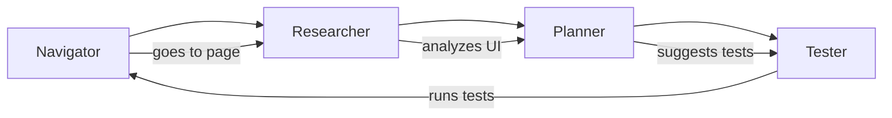

# AI Agents

Explorbot uses specialized AI agents that each handle a specific part of the testing workflow. This separation keeps each agent focused and cost-efficient.

## Agent Overview



## Navigator Agent

**Purpose:** Handles all browser interactions — clicks, form fills, navigation.

**What it does:**
- Executes CodeceptJS commands in the browser
- Tries multiple locator strategies when selectors fail
- Automatically resolves failed interactions without stopping
- Remembers what worked (and what didn't) for next time

**Why you'll love it:**
- No more `ElementNotFound` exceptions killing your test runs
- Self-healing when your UI changes
- Learns optimal selectors for your specific app

**Commands that use Navigator:**
- `/navigate <target>`
- `I.click()`, `I.fillField()`, `I.amOnPage()`, etc.

## Researcher Agent

**Purpose:** Analyzes pages to understand what's actually there.

**What it does:**
- Discovers all interactive UI elements
- Expands hidden content (accordions, dropdowns, modals)
- Maps navigation paths and form structures
- Identifies accessibility issues
- Extracts structured data from tables and lists

**Why you'll love it:**
- Discovers UI elements you forgot existed
- Gives you a complete picture of what's testable
- Documents forms with all their validation rules

**Commands that use Researcher:**
- `/research [url]`
- `/data`
- `/aria`

## Planner Agent

**Purpose:** Generates test scenarios from research findings.

**What it does:**
- Creates business-focused test scenarios
- Assigns priority levels (HIGH/MEDIUM/LOW)
- Generates expected outcomes for verification
- Balances positive and negative test cases
- Avoids duplicating existing scenarios

**Why you'll love it:**
- Creates tests that matter, not just "click stuff"
- Prioritizes by risk (critical flows first)
- Focuses on UI-testable functionality

**Commands that use Planner:**
- `/plan [feature]`
- `/explore`

## Tester Agent

**Purpose:** Executes the planned scenarios.

**What it does:**
- Runs test scenarios step by step
- Adapts when things don't go as expected
- Tracks state changes during execution
- Documents actual results vs. expected
- Uses research context for smart decisions

**Why you'll love it:**
- Handles unexpected modals and popups
- Recovers from minor failures automatically
- Produces detailed execution logs

**Commands that use Tester:**
- `/test [scenario]`
- `/explore`

## Captain Agent *(coming soon)*

**Purpose:** Orchestrates the whole testing session.

**What it does:**
- Coordinates all agents intelligently
- Responds to user commands in real-time
- Adjusts strategy based on discoveries
- Manages conversation context efficiently

## Per-Agent Model Configuration

You can optimize costs by using different models for different agents:

```javascript
export default {
  ai: {
    provider: groq,
    model: 'gpt-oss-20b',
    visionModel: 'llama-scout-4',
    agents: {
      navigator: { model: 'gpt-oss-20b' },
      researcher: { model: 'gpt-oss-20b', visionModel: 'llama-scout-4' },
      planner: { model: 'gpt-oss-20b' },
      tester: { model: 'gpt-oss-20b' },
    },
  },
};
```

**Typical optimization:**
- Navigator needs fast responses for real-time interaction
- Researcher benefits from vision capabilities
- Planner can use a slightly larger model for better test design
- Tester needs tool use for execution

## How Agents Communicate

Agents share context through:

1. **State Manager** — Tracks current page, URL, navigation history
2. **Research Results** — Structured page analysis available to Planner and Tester
3. **Experience Files** — Learned patterns shared across sessions
4. **Knowledge Files** — Domain knowledge you provide

Each agent maintains minimal context to keep costs down. They request specific information when needed rather than carrying full conversation history.
