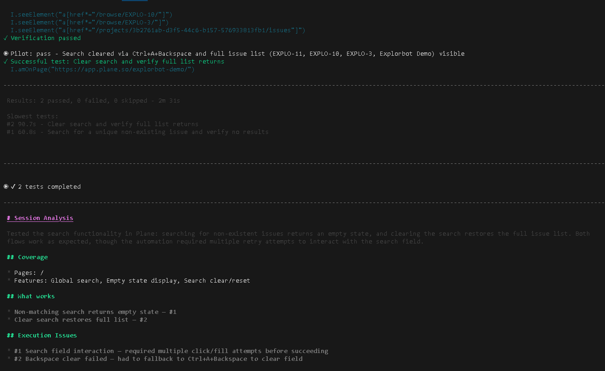

# Getting Started

Explorbot explores your web app, plans tests, and runs them — no test scripts. This guide gets you from zero to your first test in about ten minutes.

The path is short: install, configure, tell it how to log in, then point it at one feature and let it work.

## 1. Install

```bash
npm i explorbot --save
npx playwright install
```

You need Node.js 24+ (or Bun), an AI provider key, and a modern terminal — iTerm2, WARP, Kitty, Ghostty, or Windows Terminal with WSL. For the full compatibility checklist, see [Prerequisites](./prerequisites.md).

## 2. Configure

Create the config files:

```bash
npx explorbot init
```

This writes `explorbot.config.js`, an `.env` file for your keys, and an `output/` folder.

Open `.env` and add your provider key:

```bash
OPENROUTER_API_KEY=sk-...
```

Then open `explorbot.config.js` and set your app's base URL — the host only, no path:

```javascript
import { createOpenRouter } from '@openrouter/ai-sdk-provider';

const openrouter = createOpenRouter({
  apiKey: process.env.OPENROUTER_API_KEY,
});

export default {
  web: {
    url: 'http://localhost:3000',
  },
  ai: {
    model: openrouter('openai/gpt-oss-20b:nitro'),
    visionModel: openrouter('google/gemma-4-31b-it'),
    agenticModel: openrouter('minimax/minimax-m2.5:nitro'),
  },
};
```

Explorbot uses three models. Pick each one for speed and cost:

| Model | Config key | Used by | Pick |
|-------|-----------|---------|------|
| `model` | `ai.model` | Tester, Navigator, Researcher — they read HTML and ARIA on every step | a fast, cheap model (e.g. `openai/gpt-oss-20b:nitro`) |
| `visionModel` | `ai.visionModel` | screenshot analysis | a vision model (e.g. `google/gemma-4-31b-it`) |
| `agenticModel` | `ai.agenticModel` | Captain and Pilot — they read short action logs and make the big decisions | a smarter model (e.g. MiniMax 2.5, Grok Fast) |

Captain and Pilot barely use tokens, so a smarter `agenticModel` improves results for almost no extra cost. OpenRouter is the simplest start — one key, many models. To use OpenAI, Anthropic, Groq, or others, see [Providers](./providers.md). For every config option, see [Configuration](../reference/configuration.md).

## 3. Tell Explorbot how to log in

Most apps need a login. Give Explorbot the credentials once, and it signs in on its own:

```bash
npx explorbot learn "/login" "Use credentials: admin@example.com / secret123"
```

This saves a knowledge file under `knowledge/`. Explorbot reads it whenever it opens the login page. Use `*` as the URL pattern for knowledge that applies to every page.

To skip the login on later runs, add `--session`. Explorbot logs in once and restores the saved cookies next time:

```bash
npx explorbot start /login --session        # logs in, saves the session
npx explorbot start /dashboard --session    # restores it, skips login
```

Keep real secrets in environment variables, and handle cookie banners, modals, and test data the same way — see [Customization](../web-testing/customization.md).

## 4. Pick one feature to test

Don't point Explorbot at your homepage. Start it on a single focused feature — a page with a clear, visible CRUD interface it can work with. Good first targets:

- `/admin/projects`
- `/posts`
- `/admin/users`
- any list-and-edit or settings page

A page where you can create, edit, and delete items gives Explorbot an obvious job and a clear way to tell whether it worked.

## 5. Run

```bash
npx explorbot start /admin/projects
```

The browser runs hidden by default. Add `--show` to watch it:

```bash
npx explorbot start /admin/projects --show
```

When the terminal UI opens, type `/explore`. Explorbot researches the page, plans tests, runs them, and repeats. To go one step at a time:

> [!WARNING]
> Run your first `/explore` against staging, a disposable workspace, or another isolated environment with non-production data. Explorbot can create, edit, and delete records while testing. Make sure the data is safe to change and easy to restore.

```
/research    # analyze the current page
/plan        # propose test scenarios
/test        # run the next test
```

### What a successful run looks like

A completed exploration shows the test totals, a session analysis, the covered features, and any execution issues that need review:



## The concepts

You have now touched everything Explorbot is built on. Here is the whole vocabulary, once:

- **State** — where the bot is: the page URL plus its main headings (`h1`, `h2`). States anchor navigation, learning, and loop detection.
- **Research** — reading a page. The Researcher agent maps forms, buttons, tables, and navigation into a UI map the other agents work from. Saved under `output/research/`. See [Researcher](../web-testing/researcher.md).
- **Plan** — test scenarios invented from research, with priorities and expected outcomes. Markdown you can read and edit, in `output/plans/`. See [Test plans](../workflow/test-plans.md).
- **Test** — one scenario executed step by step in the real browser. Passing tests are saved as runnable Playwright or CodeceptJS code in `output/tests/`. See [Automated tests](../web-testing/automated-tests.md).
- **Knowledge** — facts you teach Explorbot: credentials, quirks, hints. Markdown files in `knowledge/`, matched to pages by URL — you wrote your first one in step 3. See [Knowledge](../workflow/knowledge.md).
- **Experience** — what Explorbot learns by doing: failed attempts and the fixes that worked, saved in `experience/` and reused on every later run. Knowledge you write; experience it earns. See [Learning](../web-testing/basics.md#learning).
- **Agents** — the AI workers behind each step: Researcher, Planner, Tester, Pilot, and more, each with its own job and model. See [Agents](../web-testing/agents.md).
- **Report** — the end-of-session summary of defects, UX findings, and coverage in `output/reports/`. See [Reporting](../workflow/reporting.md).

## Next steps

- [Running Explorbot](./running.md) — the TUI you just used, the headless CLI, and when to use each.
- [Customization](../web-testing/customization.md) — login, cookie bars, modals, and test data.
- [Commands](../reference/commands.md) — every command, in the terminal and on the CLI.
- [Knowledge](../workflow/knowledge.md) — teach Explorbot more about your app.
