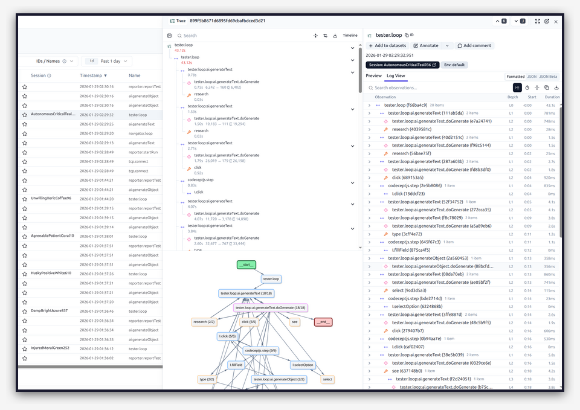

# Observability & Debugging

Explorbot integrates with [Langfuse](https://langfuse.com) for tracing. Use it to see what happened during a session: what data each agent received, which tools it called, and how it decided.



## Why Observability?

Without traces, you only see the final test result and basic logs. When Explorbot runs on its own, you need to see:

- What prompts went to the AI.
- What tools were called, and with what parameters.
- Token usage and cost per session.
- How long each operation took.
- Errors and retries.

Use this data to:

- Debug failed tests. See what the AI saw and decided.
- Create Knowledge fixes. Find the context that was missing.
- Tune prompts and agent performance.
- Understand why a test passed or failed.
- Export sessions for the `/explorbot-debug` skill.

## Setting Up Langfuse

### 1. Create a Langfuse Account

Sign up at [langfuse.com](https://langfuse.com) (free tier available) or self-host.

### 2. Get Your API Keys

From your Langfuse project settings, copy:
- **Public Key**
- **Secret Key**

### 3. Configure Explorbot

Add credentials to your `.env` file:

```bash
LANGFUSE_PUBLIC_KEY=pk-lf-xxxxxxxx
LANGFUSE_SECRET_KEY=sk-lf-xxxxxxxx
```

Or configure in `explorbot.config.js`:

```javascript
export default {
  ai: {
    model: groq('gpt-oss-20b'),
    langfuse: {
      enabled: true,
      publicKey: process.env.LANGFUSE_PUBLIC_KEY,
      secretKey: process.env.LANGFUSE_SECRET_KEY,
      baseUrl: 'https://cloud.langfuse.com', // or your self-hosted URL
    },
  },
};
```

### 4. Run Explorbot

Once configured, Explorbot traces every AI call. No code changes needed.

## What Gets Traced

Explorbot uses the [Vercel AI SDK integration](https://langfuse.com/docs/integrations/vercel-ai-sdk) with Langfuse. Each session captures:

| Trace | Description |
|-------|-------------|
| `test: <scenario>` | Full test execution cycle |
| `researcher: <url>` | Page analysis by Researcher agent |
| `planner: <url>` | Test scenario generation |
| `driller: <url>` | Component drilling |
| `ai.generateText` | Text generation calls |
| `ai.generateObject` | Structured output calls |
| `codeceptjs.step` | Individual browser actions |

Navigator has no span of its own — its AI calls appear as `ai.*` spans under the parent trace.

## Analyzing Sessions

### In Langfuse Dashboard

1. Open your Langfuse project
2. Find the session by timestamp or name
3. Click to see the full trace tree
4. Inspect individual spans for:
   - Input prompts
   - Output responses
   - Token counts
   - Duration
   - Errors

## Debugging with Claude Code

Explorbot includes a Claude Code skill that analyzes failed sessions.

### Using the Debug Skill

Find the failed `test: <scenario>` trace in Langfuse and copy its trace ID. Then, in Claude Code, run:

```
/explorbot-debug
```

Give it the trace ID — the skill fetches the trace with all its observations via `bun .claude/skills/explorbot-debug/langfuse-export.ts <trace-id>`. The trace holds the full context: prompts, tool calls, page states, and AI decisions. Without a trace ID, the skill analyzes `output/explorbot.log` instead.

### What the Skill Analyzes

The skill looks for three failure patterns:

| Pattern | Symptoms | Solution |
|---------|----------|----------|
| **Missing Context** | Wrong element clicked, didn't understand UI | Add Knowledge file with disambiguation rules |
| **Wrong Prompts** | Incorrect assumptions, wrong flow | Add Knowledge with business context |
| **Wrong Tool Choice** | Used click when form needed, typing issues | Add Knowledge with CodeceptJS code examples |

### How It Helps

1. Extracts key data from the trace with jq:
   - Failed tool calls
   - URLs visited
   - Prompts sent to the AI

2. Identifies the root cause of failures.

3. Suggests Knowledge files to fix the issue:
   ```markdown
   ---
   url: /admin/users/*
   ---

   ## User Table
   Each row has same buttons. Use container:
   I.click('Delete', '[data-user-id="123"]')
   ```

4. Can try interactions with browser tools, if available, and record working CodeceptJS code.

### Example Workflow

```bash
# 1. Test fails
./bin/explorbot-cli.ts explore /admin/users

# 2. Open Langfuse, find the failed "test: ..." trace, copy its trace ID

# 3. In Claude Code:
/explorbot-debug
# Provide the trace ID

# 4. Skill analyzes and suggests Knowledge fix
# 5. Create knowledge file
./bin/explorbot-cli.ts learn "/admin/users/*" "Use container context for table actions"

# 6. Re-run test
```

## Debugging Tips

### Enable Verbose Logging

```bash
./bin/explorbot-cli.ts explore /admin/users --verbose
```

Or set the environment variable:

```bash
DEBUG=explorbot:* ./bin/explorbot-cli.ts explore /admin/users
```

This shows detailed logs:

- Prompts sent to the AI
- Tool calls and results
- State transitions

### Specific Debug Namespaces

```bash
# AI provider calls only
DEBUG=explorbot:provider ./bin/explorbot-cli.ts explore /admin/users

# Navigator agent only
DEBUG=explorbot:navigator ./bin/explorbot-cli.ts explore /admin/users

# Multiple namespaces
DEBUG=explorbot:tester,explorbot:navigator ./bin/explorbot-cli.ts explore /admin/users
```

### Available Namespaces

| Namespace | What it shows |
|-----------|---------------|
| `explorbot:provider` | AI API calls, responses |
| `explorbot:provider:out` | Outgoing prompts |
| `explorbot:provider:in` | Incoming responses |
| `explorbot:navigator` | Navigation decisions |
| `explorbot:researcher` | Page analysis |
| `explorbot:planner` | Test scenario generation |
| `explorbot:tester` | Test execution |
| `explorbot:historian` | Experience saving |
| `explorbot:quartermaster` | A11y analysis |

## Cost Tracking

Langfuse tracks token usage per call. Use it to:

- Monitor cost across sessions
- Compare model efficiency
- Find expensive operations
- Tune prompts to reduce tokens

## Self-Hosting Langfuse

For privacy or compliance, you can self-host Langfuse. Langfuse v3 requires docker compose with Postgres, ClickHouse, and Redis — follow the [self-hosting docs](https://langfuse.com/self-hosting).

Then set `baseUrl` in your config:

```javascript
langfuse: {
  baseUrl: 'http://localhost:3000',
}
```
