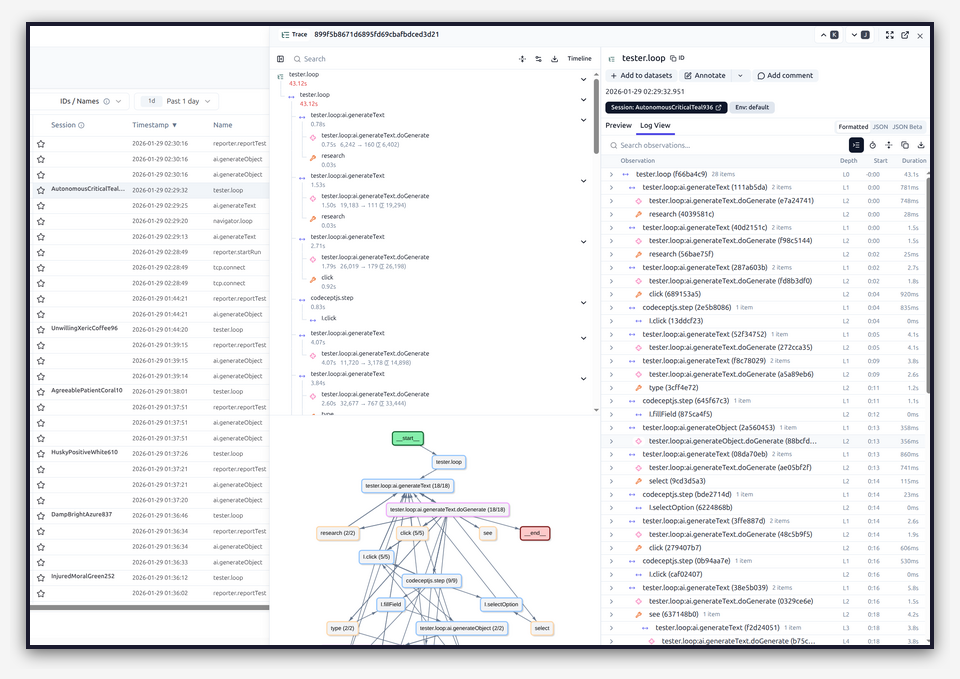

# Observability & Debugging

Explorbot integrates with [Langfuse](https://langfuse.com) for tracing and observability. This lets you analyze what happened during a session — what data was received, which tools were called, and how the agents made decisions.



## Why Observability?

When Explorbot runs autonomously, you need visibility into:

- **What prompts were sent** to the AI
- **What tools were called** and with what parameters
- **Token usage** and costs per session
- **Timing** of each operation
- **Errors and retries** that occurred

This data helps you:
- **Debug failed tests** — see exactly what AI saw and decided
- **Create Knowledge fixes** — understand what context was missing
- Optimize prompts and agent performance
- Understand why a test passed or failed
- Export sessions for analysis with `/explorbot-debug` skill

## Setting Up Langfuse

### 1. Create a Langfuse Account

Sign up at [langfuse.com](https://langfuse.com) (free tier available) or self-host.

### 2. Get Your API Keys

From your Langfuse project settings, copy:
- **Public Key**
- **Secret Key**

### 3. Configure Explorbot

Add credentials to your `.env` file:

```bash
LANGFUSE_PUBLIC_KEY=pk-lf-xxxxxxxx
LANGFUSE_SECRET_KEY=sk-lf-xxxxxxxx
```

Or configure in `explorbot.config.js`:

```javascript
export default {
  ai: {
    provider: groq,
    model: 'gpt-oss-20b',
    langfuse: {
      enabled: true,
      publicKey: process.env.LANGFUSE_PUBLIC_KEY,
      secretKey: process.env.LANGFUSE_SECRET_KEY,
      baseUrl: 'https://cloud.langfuse.com', // or your self-hosted URL
    },
  },
};
```

### 4. Run Explorbot

Once configured, all AI calls are automatically traced. No code changes needed.

## What Gets Traced

Explorbot uses the [Vercel AI SDK integration](https://langfuse.com/docs/integrations/vercel-ai-sdk) with Langfuse. Each session captures:

| Trace | Description |
|-------|-------------|
| `tester.loop` | Full test execution cycle |
| `research` | Page analysis by Researcher agent |
| `navigator.loop` | Navigation and interaction attempts |
| `ai.generateText` | Text generation calls |
| `ai.generateObject` | Structured output calls |
| `codeceptjs.step` | Individual browser actions |
| `I.click`, `I.fillField`, etc. | Specific CodeceptJS commands |

## Analyzing Sessions

### In Langfuse Dashboard

1. Open your Langfuse project
2. Find the session by timestamp or name
3. Click to see the full trace tree
4. Inspect individual spans for:
   - Input prompts
   - Output responses
   - Token counts
   - Duration
   - Errors

### Export for AI Analysis

Export a session as JSON from Langfuse for detailed debugging:

1. Open your Langfuse project
2. Find the failed `tester.loop` trace
3. Click the **Export** button (or use the API)
4. Save as JSON file (e.g., `failed-session.json`)

The trace contains the full context: prompts, tool calls, page states, and AI decisions.

## Debugging with Claude Code

Explorbot includes a Claude Code skill for analyzing failed sessions.

### Using the Debug Skill

In Claude Code, run:

```
/explorbot-debug
```

The skill will ask for:
1. **Langfuse JSON export** — path to your exported trace file
2. **Or nothing** — it will analyze `output/explorbot.log` instead

### What the Skill Analyzes

The debug skill looks for three failure patterns:

| Pattern | Symptoms | Solution |
|---------|----------|----------|
| **Missing Context** | Wrong element clicked, didn't understand UI | Add Knowledge file with disambiguation rules |
| **Wrong Prompts** | Incorrect assumptions, wrong flow | Add Knowledge with business context |
| **Wrong Tool Choice** | Used click when form needed, typing issues | Add Knowledge with CodeceptJS code examples |

### How It Helps

1. **Extracts key data** from trace using jq:
   - Failed tool calls
   - URLs visited
   - Prompts sent to AI

2. **Identifies root cause** of failures

3. **Suggests Knowledge files** to fix the issue:
   ```markdown
   ---
   url: /admin/users/*
   ---

   ## User Table
   Each row has same buttons. Use container:
   I.click('Delete', '[data-user-id="123"]')
   ```

4. **Can try interactions** using browser tools (if available) and document working CodeceptJS code

### Why Langfuse Matters for Debugging

Without Langfuse, you only see:
- Final test result (pass/fail)
- Basic logs

With Langfuse traces, you can see:
- Exact prompts AI received at each step
- What page state AI was analyzing
- Which tool calls succeeded/failed and why
- Token usage and timing
- Full decision chain

This makes debugging AI behavior possible — you can trace exactly where and why it went wrong.

### Example Workflow

```bash
# 1. Test fails
explorbot explore --from /admin/users

# 2. Open Langfuse, find tester.loop trace, export JSON
# Save to: ./traces/failed-users-test.json

# 3. In Claude Code:
/explorbot-debug
# Provide path: ./traces/failed-users-test.json

# 4. Skill analyzes and suggests Knowledge fix
# 5. Create knowledge file
explorbot know "/admin/users/*" "Use container context for table actions"

# 6. Re-run test
```

## Debugging Tips

### Enable Verbose Logging

```bash
explorbot explore --verbose
```

Or set the environment variable:

```bash
DEBUG=explorbot:* explorbot explore
```

This shows detailed logs including:
- Prompts sent to AI
- Tool calls and results
- State transitions

### Specific Debug Namespaces

```bash
# AI provider calls only
DEBUG=explorbot:provider explorbot explore

# Navigator agent only
DEBUG=explorbot:navigator explorbot explore

# Multiple namespaces
DEBUG=explorbot:tester,explorbot:navigator explorbot explore
```

### Available Namespaces

| Namespace | What it shows |
|-----------|---------------|
| `explorbot:provider` | AI API calls, responses |
| `explorbot:provider:out` | Outgoing prompts |
| `explorbot:provider:in` | Incoming responses |
| `explorbot:navigator` | Navigation decisions |
| `explorbot:researcher` | Page analysis |
| `explorbot:planner` | Test scenario generation |
| `explorbot:tester` | Test execution |
| `explorbot:historian` | Experience saving |
| `explorbot:quartermaster` | A11y analysis |

## Cost Tracking

Langfuse tracks token usage per call. Use this to:

- Monitor costs across sessions
- Compare model efficiency
- Identify expensive operations
- Optimize prompts to reduce tokens

## Self-Hosting Langfuse

For privacy or compliance, you can [self-host Langfuse](https://langfuse.com/docs/deployment/self-host):

```bash
# Docker
docker run -d -p 3000:3000 langfuse/langfuse
```

Then set `baseUrl` in your config:

```javascript
langfuse: {
  baseUrl: 'http://localhost:3000',
}
```
