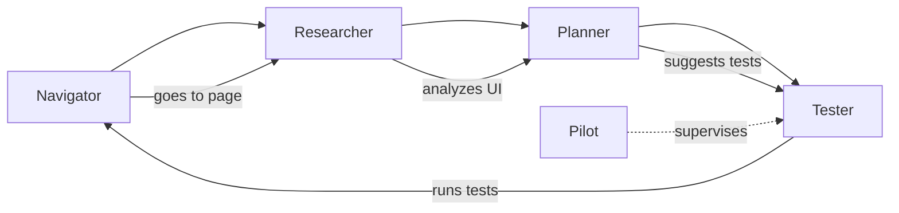

# AI Agents

Explorbot splits the testing workflow across specialized AI agents. Each agent handles one part of the work, which keeps it focused and keeps token costs down.

## Agent Overview



## Navigator Agent

Handles browser interactions: clicks, form fills, and navigation.

The Navigator runs CodeceptJS commands in the browser. When a selector fails, it tries other locator strategies and resolves the interaction without stopping the run. It remembers what worked and what didn't, so failed selectors don't keep killing your runs and tests survive UI changes.

Commands that use Navigator:
- `/navigate <target>`
- `I.click()`, `I.fillField()`, `I.amOnPage()`, etc.

## Researcher Agent

Analyzes pages to find what's actually on them.

The Researcher discovers every interactive element, including content hidden in accordions, dropdowns, and modals. It maps navigation paths and form structures, extracts data from tables and lists, and filters out noise like cookie banners and ads. The result is a complete map of what you can test, with form validation rules documented. You can tune the filtering to focus on what matters.

Commands that use Researcher:
- `npx explorbot research /path` (CLI)
- `/research [path]` (TUI)
- `/research --deep` — expand hidden elements
- `/research --screenshot` — use vision model

See [Researcher Agent](./researcher.md) for configuration and usage.

## Planner Agent

Generates test scenarios from research findings.

The Planner writes business-focused scenarios with priority levels (critical/important/high/normal/low) and expected outcomes for verification. It balances positive and negative cases, skips scenarios you already have, and cycles through planning styles (normal, psycho, curious) to broaden coverage across iterations. You can add your own styles and page-specific rules.

Commands that use Planner:
- `/plan [--focus <feature>]`
- `/explore`

See [Planner Agent](../guides/planner.md) for planning styles, customization, and configuration.

## Tester Agent

Runs the planned scenarios.

The Tester executes scenarios step by step and adapts when something goes wrong. It tracks state changes during execution, records actual results against expected ones, and uses research context to make decisions. It handles unexpected modals and popups, recovers from minor failures on its own, and produces detailed execution logs.

Commands that use Tester:
- `/test [scenario]`
- `/explore`

## Pilot Agent

Supervises the Tester and steps in when a test gets stuck.

The Pilot keeps a separate conversation to track progress over time. It detects stuck patterns — loops, repeated failures, no page changes — and decides what context the Tester needs next (HTML, ARIA, UI map). When automated recovery fails, it asks the user for help instead of giving up.

Because the Pilot sees only tool summaries rather than raw HTML, you can run it on a smarter model without a token cost explosion.

The Pilot intervenes when:
- Actions succeed but the page doesn't change (wrong element)
- The same action repeats several times (loop)
- The same locator keeps failing (need a different approach)
- Only research or context calls run, with no action tools (no progress)

## Analyst Agent

Produces a human-readable session report after `/explore` and `/freesail` runs.

The Analyst reads every test in the session — scenario, expected outcome, final result, notes, and step log. It clusters tests by root cause: three tests that fail on the same dropdown become one defect with three test references, not three rows. Findings are bucketed into Defects, UX issues, and Execution issues, each with reproduce steps and one-line evidence from the test log.

The Analyst writes markdown directly, with no schema-to-render layer. The same text goes to the console, the report file, and the Testomat.io run description.

When it runs:
- Automatically at the end of `/explore` (per-run)
- Automatically on app exit (session-wide, across multiple `/explore` or `/freesail` runs)

Output:
- Console: the markdown is printed under the test results table
- File: `output/reports/<mode>-<sessionName>.md` — e.g. `explore-WiseFox42.md`, `freesail-CleverOwl91.md`. Each session gets a unique name, in a different format from per-test sessions, so the two are distinguishable on disk
- Testomat.io: when the reporter is enabled, the markdown becomes the run description on the cloud dashboard

Report shape:

```markdown
# Session Analysis

5 tests executed, 1 defect identified — pagination button does not navigate to the next page.

## Defects

### 🔴 Pagination button does not navigate to second page
Affects: #3
Reproduce:
  1. Open /projects/runs
  2. Click the page-2 pagination control
Evidence: URL did not change and the listed run IDs stayed identical

## UX issues

- **Filter panel "Apply" button is hidden behind a sticky footer** — #4
  scroll required before the button is interactable

## Execution Issues

- **Search runs by name** — typed query but list never re-rendered, so the test could not verify whether the filter applied
- **Export run as PDF** — clicked Export but no download dialog or feedback appeared, so success could not be confirmed
```

Severity emoji (defects only): 🔴 critical/high, 🟡 medium, 🟢 low.

The report puts defects at the top with reproduce steps already written, so you can skim a 50-test run in seconds. Clustering by root cause keeps near-identical rows out. Execution Issues explain what was unreliable in plain words ("modal trapped focus", "no accessible label", "page reloaded before the assertion ran") instead of dumping log lines.

Configuration:

```javascript
export default {
  ai: {
    agents: {
      analyst: {
        // model: openai('gpt-4o'),       // override the default model
        // systemPrompt: 'Focus on...',   // append guidance to the prompt
        // enabled: false,                // disable the analyst entirely
      },
    },
  },
};
```

The agent uses the default model unless you override it. The report file is always written to `output/reports/`; the file has no opt-out, but `enabled: false` turns the agent off so nothing runs.

## Captain Agent

Handles your direct requests in the TUI and recovers the session when something breaks.

The Captain steps in when a slash command isn't enough — answering questions about your setup, inspecting tests and page states, and reading recent output before it replies. It works in four modes:

- **idle** — plan management, project inspection, knowledge and experience files; available before any page loads
- **web** — page interaction, navigation, and browser diagnostics
- **test** — test timeline, state inspection, generated code and logs
- **heal** — browser and test recovery when an active test loses its page or browser

When a test hits a fatal browser error, the Captain tries to recover — reload, restart the browser, open a fresh tab, or close extra tabs — before the test is stopped, then tells the Tester how to continue. It runs on explicit TUI requests and on test interrupts (stop, pass, skip, or redirect a running test).

## Per-Agent Model Configuration

Use different models for different agents to control cost:

```javascript
export default {
  ai: {
    model: groq('gpt-oss-20b'),
    visionModel: groq('llama-scout-4'),
    agents: {
      navigator: { model: groq('gpt-oss-20b') },
      researcher: {
        model: groq('gpt-oss-20b'),
        excludeSelectors: ['.cookie-banner'],
      },
      planner: { model: groq('gpt-oss-20b') },
      tester: { model: groq('gpt-oss-20b'), progressCheckInterval: 5 },
      pilot: { stepsToReview: 5 },
    },
  },
};
```

Typical choices:
- Navigator needs fast responses for real-time interaction
- Researcher benefits from vision
- Planner can use a larger model for better test design
- Tester needs tool use for execution
- Pilot can use a smarter model — it only processes tool summaries, not HTML or ARIA

## How Agents Communicate

Agents share context through four channels:

1. **State Manager** — tracks the current page, URL, and navigation history
2. **Research Results** — structured page analysis available to Planner and Tester
3. **Experience Files** — patterns learned across sessions. Injected as a compact table of contents (file tags plus section headings) rather than full bodies; agents pull individual sections on demand via the `learnExperience` tool
4. **Knowledge Files** — domain knowledge you provide

Each agent keeps its context minimal to hold costs down. Agents request specific information when they need it instead of carrying full conversation history.

The Pilot keeps a separate conversation from the Tester. The Tester's conversation carries heavy HTML and ARIA context; the Pilot sees only tool execution summaries (what succeeded, what failed, what changed). That lets the Pilot run on expensive models without a token cost explosion.
