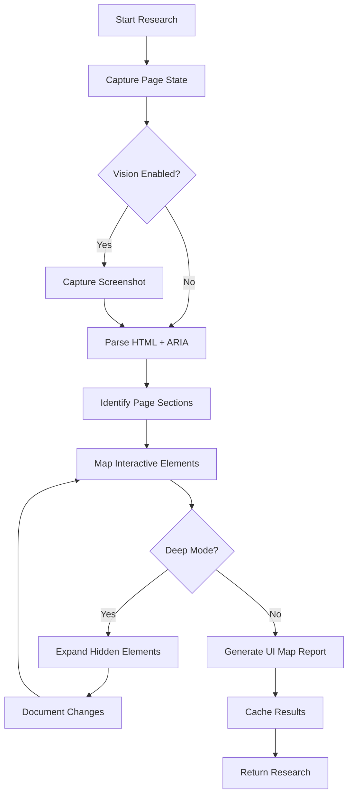
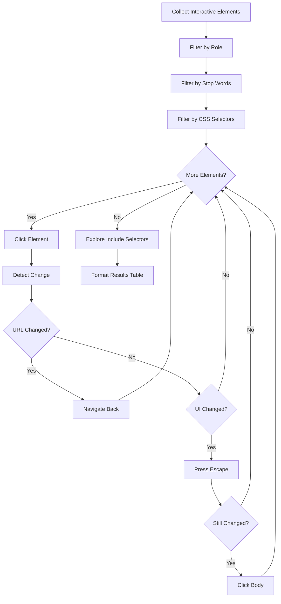

# Researcher Agent

The Researcher agent analyzes web pages to understand their structure, identify interactive elements, and create UI maps. It's the foundation for intelligent test planning and navigation.

## Why Research Matters

Research is the essential first step in Explorbot's workflow. Before the system can plan tests or navigate intelligently, it needs to understand what's on the page.

**The Researcher is used by other agents:**
- **Planner** - launches research automatically before generating test scenarios
- **Tester** - uses research to understand page context during test execution
- **Navigator** - relies on research to find elements and navigate

You can also run research manually to inspect a page or debug issues.

## Usage

### CLI Mode

```bash
# Research a specific path (relative to url in config)
explorbot research /login
explorbot research /admin/users

# Research with options
explorbot research /dashboard --deep
explorbot research /products --screenshot
```

### TUI Mode (Interactive)

```bash
# Research current page
/research

# Research with deep expansion (clicks dropdowns, tabs, etc.)
/research --deep

# Research with data extraction
/research --data

# Research specific path
/research /login
/research /admin/pages

# Force fresh research (bypass cache)
/research --force

# Research with screenshot analysis (requires vision model)
/research --screenshot
```

### Automatic Research

Research runs automatically as part of other commands:

```bash
# Planner researches page before planning
explorbot plan --from /dashboard

# Explorer researches each new page discovered
explorbot explore --from /admin
```

## How It Works

When researching a page, the Researcher:

1. **Captures page state** - HTML, ARIA tree, and optionally a screenshot
2. **Analyzes structure** - Identifies sections (focus areas, lists, menus, content)
3. **Maps UI elements** - Creates a table of interactive elements with locators
4. **Caches results** - Stores research in `output/research/` for 1 hour



### Research Modes

#### Standard Research (HTML + ARIA)

```bash
/research
```

Analyzes page using HTML and ARIA tree. Fast and works with any model.

#### Deep Research

```bash
/research --deep
```

Expands hidden elements (dropdowns, accordions, tabs) to discover more UI. Clicks through interactive elements and documents what appears.

#### Research with Data Extraction

```bash
/research --data
```

Extracts domain-specific content (articles, products, users) as structured data.

## Vision Model Support

### Without Vision

The researcher works with text-only models by analyzing:
- HTML structure and attributes
- ARIA accessibility tree
- Element roles and names

This is sufficient for most pages and is faster/cheaper.

### With Vision

When a vision model is configured, the researcher can:
- Analyze screenshots for visual elements
- Detect icons, images, and visual indicators
- Provide element coordinates for visual clicking
- Answer questions about what's displayed

Enable vision in config:

```javascript
ai: {
  vision: true,
  visionModel: 'gpt-4o',  // or any vision-capable model
}
```

Use screenshot analysis:

```bash
explorbot research /products --screenshot
# or in TUI
/research --screenshot
```

Vision is particularly useful for:
- Pages with icon-only buttons
- Canvas-based UIs
- When HTML doesn't reflect visual layout
- Debugging element location issues

## Interactive Exploration

When exploring a page, the researcher clicks through elements to discover their behavior:

```
[1/10] Exploring: "Settings" (button)
[2/10] Exploring: "Help" (link)
...
```



For each element, the researcher:
1. Captures state before click
2. Clicks the element
3. Detects what changed (navigation, modal, menu, UI change)
4. Restores original state (Escape key or navigate back)

### Filtering Elements

Not all elements should be explored. The researcher filters by:

#### 1. Role Filtering

Only clickable roles are explored:
- `button`, `link`, `menuitem`, `tab`
- `option`, `combobox`, `switch`

#### 2. Stop Words

Elements matching these words are skipped (word-boundary matching):

**Default stop words:**
- `close`, `cancel`, `dismiss`, `exit`, `back`
- `cookie`, `consent`, `gdpr`, `privacy`
- `accept all`, `decline all`, `reject all`
- `share`, `print`, `download`


#### 3. CSS Selector Exclusion

Skip elements inside specific containers:

```javascript
researcher: {
  excludeSelectors: ['.cookie-banner', '#chat-widget', '[data-ad]'],
}
```

#### 4. CSS Selector Inclusion

Always explore elements inside specific containers (second pass):

```javascript
researcher: {
  includeSelectors: ['.action-menu', '#toolbar'],
}
```

## Configuration

```javascript
ai: {
  agents: {
    researcher: {
      // Standard agent options
      model: 'gpt-4o',
      systemPrompt: 'Focus on form validation elements...',

      // Exploration filtering
      excludeSelectors: ['.cookie-banner'],
      includeSelectors: ['.dropdown-menu'],
      stopWords: ['cookie', 'share'],
      maxElementsToExplore: 15,
    },
  },
}
```

### Options Reference

| Option | Type | Default | Description |
|--------|------|---------|-------------|
| `model` | `string` | - | Override default model |
| `systemPrompt` | `string` | - | Additional instructions |
| `excludeSelectors` | `string[]` | `[]` | CSS selectors to exclude |
| `includeSelectors` | `string[]` | `[]` | CSS selectors to always explore |
| `stopWords` | `string[]` | defaults | Words to filter (replaces defaults) |
| `maxElementsToExplore` | `number` | `10` | Max elements per page |

## Configuration Examples

### Skip Cookie Banners and Ads

```javascript
ai: {
  agents: {
    researcher: {
      excludeSelectors: [
        '.cookie-banner',
        '.cookie-consent',
        '#gdpr-modal',
        '[data-ad]',
        '.advertisement',
      ],
    },
  },
}
```

### Focus on Specific Areas

```javascript
ai: {
  agents: {
    researcher: {
      includeSelectors: [
        '.main-content',
        '#app-toolbar',
        '[data-testid="action-menu"]',
      ],
      excludeSelectors: [
        'nav',
        'footer',
        '.sidebar',
      ],
    },
  },
}
```

### Custom Stop Words

```javascript
ai: {
  agents: {
    researcher: {
      // Replace defaults entirely
      stopWords: ['cookie', 'newsletter', 'subscribe'],
    },
  },
}
```

### Disable Text Filtering

```javascript
ai: {
  agents: {
    researcher: {
      stopWords: [],  // Empty array disables filtering
    },
  },
}
```

### Explore More Elements

```javascript
ai: {
  agents: {
    researcher: {
      maxElementsToExplore: 25,
    },
  },
}
```

### Custom Component Guidance

```javascript
ai: {
  agents: {
    researcher: {
      systemPrompt: `
        This app uses custom components:
        - <DataGrid> renders as div with role="grid"
        - <Modal> uses [data-modal] attribute
        - Dropdowns have [data-dropdown] attribute

        Look for data-testid attributes for reliable selectors.
      `,
    },
  },
}
```

### Vision-Heavy Research

```javascript
ai: {
  vision: true,
  visionModel: 'gpt-4o',
  agents: {
    researcher: {
      systemPrompt: `
        Pay attention to:
        - Icon buttons without text labels
        - Color indicators (red = error, green = success)
        - Visual hierarchy and spacing
      `,
    },
  },
}
```

## Output Format

Research results are saved to `output/research/{hash}.md` and include:

```markdown
## Summary

Brief description of the page purpose.

## Focus Section

Modal dialog for user login...

Section Container CSS Locator: '[role="dialog"]'

| Element | ARIA | CSS | XPath | Coordinates |
|---------|------|-----|-------|-------------|
| 'Email' | { role: 'textbox', text: 'Email' } | 'input#email' | '//input[@id="email"]' | (400, 280) |

## Content Section

Main content area...
```

## Caching

Research results are cached for 1 hour:
- In memory during session
- On disk in `output/research/`

Use `--force` to bypass cache:

```bash
/research --force
```

## See Also

- [Configuration](./configuration.md) - General configuration options
- [Agents](./agents.md) - All agent descriptions
- [Knowledge Files](./knowledge.md) - Domain-specific hints
