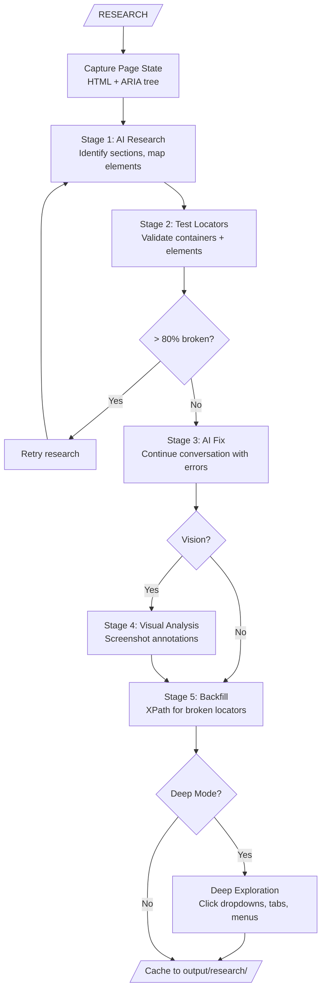
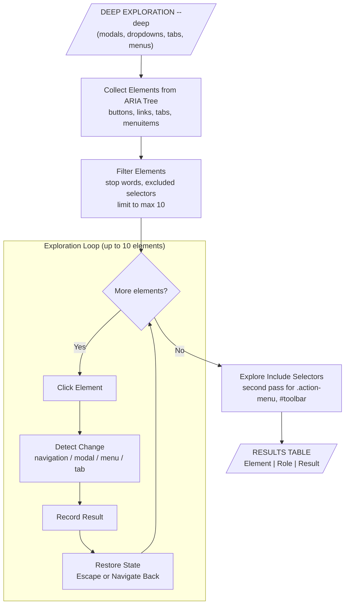

# Researcher Agent

The Researcher agent analyzes web pages to understand their structure, identify UI elements, and create detailed UI maps with locators.

## Overview

Research provides context for test planning and execution:

- **Planner** — calls Researcher before generating test scenarios
- **Tester** — uses research results to understand page context during execution

You can also run research manually to inspect pages or debug locator issues.

## Usage

### CLI Mode

```bash
# Research a specific path (relative to url in config)
explorbot research /login
explorbot research /admin/users

# Research with options
explorbot research /dashboard --deep
explorbot research /products --screenshot
```

### TUI Mode (Interactive)

```bash
# Research current page
/research

# Research with deep expansion (clicks dropdowns, tabs, etc.)
/research --deep

# Research with data extraction
/research --data

# Research specific path
/research /login
/research /admin/pages

# Force fresh research (bypass cache)
/research --force

# Research with screenshot analysis (requires vision model)
/research --screenshot

# Skip locator validation and fixing
/research --no-fix
```

### Automatic Research

Research runs automatically as part of other commands:

```bash
# Planner researches page before planning
explorbot plan /dashboard

# Explorer researches each new page discovered
explorbot explore /admin
```

## How It Works

Research runs as a 5-stage pipeline:

1. **Research** — AI analyzes HTML + ARIA tree and produces a UI map with sections, containers, and locators
2. **Test** — Validates all containers and locators against the live page using Playwright. Captures exact match counts (0 elements, 3 elements, dynamic ID)
3. **Fix** — Continues the same AI conversation with broken locator details. AI fixes them with full context from stage 1
4. **Visual analysis** — Annotates elements on screenshot, extracts coordinates/colors/icons (requires vision model)
5. **Backfill** — Elements still missing working locators get XPath from the DOM. Broken containers are nullified


```mermaid
flowchart TD
    A[/"RESEARCH"/] --> B[Capture Page State<br/>HTML + ARIA tree]
    B --> C[Stage 1: AI Research<br/>Identify sections, map elements]
    C --> D[Stage 2: Test Locators<br/>Validate containers + elements]
    D --> E{> 80% broken?}
    E -->|Yes| F[Retry research]
    F --> C
    E -->|No| G[Stage 3: AI Fix<br/>Continue conversation with errors]
    G --> H{Vision?}
    H -->|Yes| I[Stage 4: Visual Analysis<br/>Screenshot annotations]
    H -->|No| J
    I --> J[Stage 5: Backfill<br/>XPath for broken locators]
    J --> K{Deep Mode?}
    K -->|Yes| L[Deep Exploration<br/>Click dropdowns, tabs, menus]
    L --> M
    K -->|No| M[/"Cache to output/research/"/]
```

### Locator Validation

After AI produces research, every locator is tested against the live page:

- **Containers** are tested first. If all containers are broken, research retries entirely
- **Element locators** scoped to broken containers are marked as broken without testing (container broken → all its children broken)
- Remaining locators are tested individually, capturing exact element counts
- Forbidden locators (dynamic IDs like `#ember123`, `#react-select-*`) are rejected automatically
- If > 80% of locators are broken, research retries with a fresh AI call

### Locator Fixing (Conversation Continuation)

When locators are broken, the Researcher continues the **same AI conversation** from stage 1. The AI already has full context about the page, so it can fix locators more accurately than a separate call would.

The fix prompt includes Playwright-style test results:

```
## Navigation

> Container: '.nav-bar'

Tested Elements:
- 'Home': page.locator('.nav-bar').locator('a.home') ← OK
- 'Settings': page.locator('.nav-bar').locator('a.settings-btn') ← BROKEN (0 elements)
- 'Profile': page.locator('.nav-bar').getByRole('link', { name: 'Profile' }) ← BROKEN (2 elements)
```

### XPath Backfill

Elements that still have no working CSS or ARIA locator after AI fixing get an XPath automatically generated from the DOM via `WebElement.fromEidxList()`. This is a last resort — XPaths are positional and fragile, but better than nothing.

### Research Modes

#### Standard Research (HTML + ARIA)

```bash
/research
```

Analyzes page using HTML and ARIA tree. Fast and works with any model.

#### Deep Research

```bash
/research --deep
```

Expands hidden elements (dropdowns, accordions, tabs) to discover more UI. Clicks through interactive elements and documents what appears.

#### Research with Data Extraction

```bash
/research --data
```

Extracts domain-specific content (articles, products, users) as structured data.

## Page Sections

The Researcher breaks pages into sections based on their UI purpose. Sections are identified in priority order:

| Section | Description |
|---------|-------------|
| `focus` | Focused overlay (modal, drawer, popup, active form) |
| `list` | List area (items collection, table, cards, or list view) |
| `detail` | Detail area (selected item preview or full details) |
| `panes` | Screen is split into equal panes |
| `content` | Main area of page |
| `menu` | Page menu (toolbar, context actions, filters, dropdowns) |
| `navigation` | Main navigation (top bar, sidebar, breadcrumbs) |

Each section includes:
- A **container CSS selector** scoping all elements within
- A **UI map table** listing interactive elements with ARIA and CSS locators

### Configuring Sections

Override the default section list via `ai.agents.researcher.sections`. This controls which sections the Researcher looks for and in what order. The Planner also uses this order when proposing tests.

```javascript
ai: {
  agents: {
    researcher: {
      // Only look for these sections, in this order
      sections: ['focus', 'content', 'list'],
    },
  },
}
```

When not set, all sections are used in the default order.

## Vision Model Support

### Without Vision

The researcher works with text-only models by analyzing:
- HTML structure and attributes
- ARIA accessibility tree
- Element roles and names

This is sufficient for most pages and is faster/cheaper.

### With Vision

When a vision model is configured, the researcher can:
- Analyze screenshots for visual elements
- Detect icons, images, and visual indicators
- Provide element coordinates for visual clicking
- Answer questions about what's displayed

Enable vision in config:

```javascript
ai: {
  vision: true,
  visionModel: 'gpt-4o',  // or any vision-capable model
}
```

Use screenshot analysis:

```bash
explorbot research /products --screenshot
# or in TUI
/research --screenshot
```

Vision is particularly useful for:
- Pages with icon-only buttons
- Canvas-based UIs
- When HTML doesn't reflect visual layout
- Debugging element location issues

## Deep Exploration

Deep exploration (`--deep` flag) discovers hidden UI by clicking through elements to find **modals, dropdowns, tabs, and menus**:

```
[1/10] Exploring: "Settings" (button) → opened modal
[2/10] Exploring: "Help" (link) → navigated to /help
[3/10] Exploring: "More" (menuitem) → opened menu
...
```


```mermaid
flowchart TD
    A[/"DEEP EXPLORATION --deep<br/>(modals, dropdowns, tabs, menus)"/] --> B
    B[Collect Elements from ARIA Tree<br/>buttons, links, tabs, menuitems] --> C
    C[Filter Elements<br/>stop words, excluded selectors<br/>limit to max 10] --> D

    subgraph LOOP ["Exploration Loop (up to 10 elements)"]
        D{More elements?} -->|Yes| E[Click Element]
        E --> F[Detect Change<br/>navigation / modal / menu / tab]
        F --> G[Record Result]
        G --> H[Restore State<br/>Escape or Navigate Back]
        H --> D
    end

    D -->|No| I[Explore Include Selectors<br/>second pass for .action-menu, #toolbar]
    I --> J[/"RESULTS TABLE<br/>Element | Role | Result"/]
```

For each element, the researcher:
1. Captures state before click
2. Clicks the element
3. Detects what changed (navigation, modal, menu, UI change)
4. Restores original state (Escape key or navigate back)

### Filtering Elements

Not all elements should be explored. The researcher filters by:

#### 1. Role Filtering

Only clickable roles are explored:
- `button`, `link`, `menuitem`, `tab`
- `option`, `combobox`, `switch`

#### 2. Stop Words

Elements matching these words are skipped (word-boundary matching):

**Default stop words:**
- `close`, `cancel`, `dismiss`, `exit`, `back`
- `cookie`, `consent`, `gdpr`, `privacy`
- `accept all`, `decline all`, `reject all`
- `share`, `print`, `download`


#### 3. CSS Selector Exclusion

Skip elements inside specific containers:

```javascript
researcher: {
  excludeSelectors: ['.cookie-banner', '#chat-widget', '[data-ad]'],
}
```

#### 4. CSS Selector Inclusion

Always explore elements inside specific containers (second pass):

```javascript
researcher: {
  includeSelectors: ['.action-menu', '#toolbar'],
}
```

## Configuration

```javascript
ai: {
  agents: {
    researcher: {
      // Standard agent options
      model: 'gpt-4o',
      systemPrompt: 'Focus on form validation elements...',

      // Page sections (order matters)
      sections: ['focus', 'content', 'list', 'menu', 'navigation'],

      // Exploration filtering
      excludeSelectors: ['.cookie-banner'],
      includeSelectors: ['.dropdown-menu'],
      stopWords: ['cookie', 'share'],
      maxElementsToExplore: 15,

      // Retry count when >80% locators are broken
      retries: 2,
    },
  },
}
```

### Options Reference

| Option | Type | Default | Description |
|--------|------|---------|-------------|
| `model` | `string` | - | Override default model |
| `systemPrompt` | `string` | - | Additional instructions |
| `sections` | `string[]` | all sections | Page sections to identify (order = priority) |
| `excludeSelectors` | `string[]` | `[]` | CSS selectors to exclude from deep exploration |
| `includeSelectors` | `string[]` | `[]` | CSS selectors to always explore |
| `stopWords` | `string[]` | defaults | Words to filter (replaces defaults) |
| `maxElementsToExplore` | `number` | `10` | Max elements per deep exploration |
| `retries` | `number` | `2` | Retries when most locators are broken |

## Configuration Examples

### Skip Cookie Banners and Ads

```javascript
ai: {
  agents: {
    researcher: {
      excludeSelectors: [
        '.cookie-banner',
        '.cookie-consent',
        '#gdpr-modal',
        '[data-ad]',
        '.advertisement',
      ],
    },
  },
}
```

### Focus on Specific Areas

```javascript
ai: {
  agents: {
    researcher: {
      includeSelectors: [
        '.main-content',
        '#app-toolbar',
        '[data-testid="action-menu"]',
      ],
      excludeSelectors: [
        'nav',
        'footer',
        '.sidebar',
      ],
    },
  },
}
```

### Limit Sections

```javascript
ai: {
  agents: {
    researcher: {
      // Only research these sections, skip navigation and menu
      sections: ['focus', 'content', 'list', 'detail'],
    },
  },
}
```

### Custom Stop Words

```javascript
ai: {
  agents: {
    researcher: {
      // Replace defaults entirely
      stopWords: ['cookie', 'newsletter', 'subscribe'],
    },
  },
}
```

### Disable Text Filtering

```javascript
ai: {
  agents: {
    researcher: {
      stopWords: [],  // Empty array disables filtering
    },
  },
}
```

### Explore More Elements

```javascript
ai: {
  agents: {
    researcher: {
      maxElementsToExplore: 25,
    },
  },
}
```

### Custom Component Guidance

```javascript
ai: {
  agents: {
    researcher: {
      systemPrompt: `
        This app uses custom components:
        - <DataGrid> renders as div with role="grid"
        - <Modal> uses [data-modal] attribute
        - Dropdowns have [data-dropdown] attribute

        Look for data-testid attributes for reliable selectors.
      `,
    },
  },
}
```

### Vision-Heavy Research

```javascript
ai: {
  vision: true,
  visionModel: 'gpt-4o',
  agents: {
    researcher: {
      systemPrompt: `
        Pay attention to:
        - Icon buttons without text labels
        - Color indicators (red = error, green = success)
        - Visual hierarchy and spacing
      `,
    },
  },
}
```

## Output Format

Research results are saved to `output/research/{hash}.md` and include:

```markdown
## Summary

Brief description of the page purpose.

## Focus Section

Modal dialog for user login...

> Container: '[role="dialog"]'

| Element | ARIA | CSS |
|---------|------|-----|
| 'Email' | { role: 'textbox', text: 'Email' } | 'input#email' |
| 'Password' | { role: 'textbox', text: 'Password' } | 'input[name="password"]' |
| 'Sign In' | { role: 'button', text: 'Sign In' } | 'button[type="submit"]' |

## Content Section

Main content area...

> Container: '.main-content'

| Element | ARIA | CSS | XPath | Coordinates |
|---------|------|-----|-------|-------------|
| 'Save' | { role: 'button', text: 'Save' } | 'button.save' | - | (400, 300) |
| 'Delete' | { role: 'button', text: 'Delete' } | - | '//button[@class="del"]' | (500, 300) |
```

Notes:
- XPath column only appears when CSS is broken and XPath was backfilled from the DOM
- Coordinates column only appears when vision model analyzed the screenshot
- Container is shown as a blockquote `> Container: '...'` before the table

## Caching

Research results are cached for 1 hour:
- In memory during session
- On disk in `output/research/`

Use `--force` to bypass cache:

```bash
/research --force
```

## See Also

- [Configuration](./configuration.md) - General configuration options
- [Agents](./agents.md) - All agent descriptions
- [Knowledge Files](./knowledge.md) - Domain-specific hints
